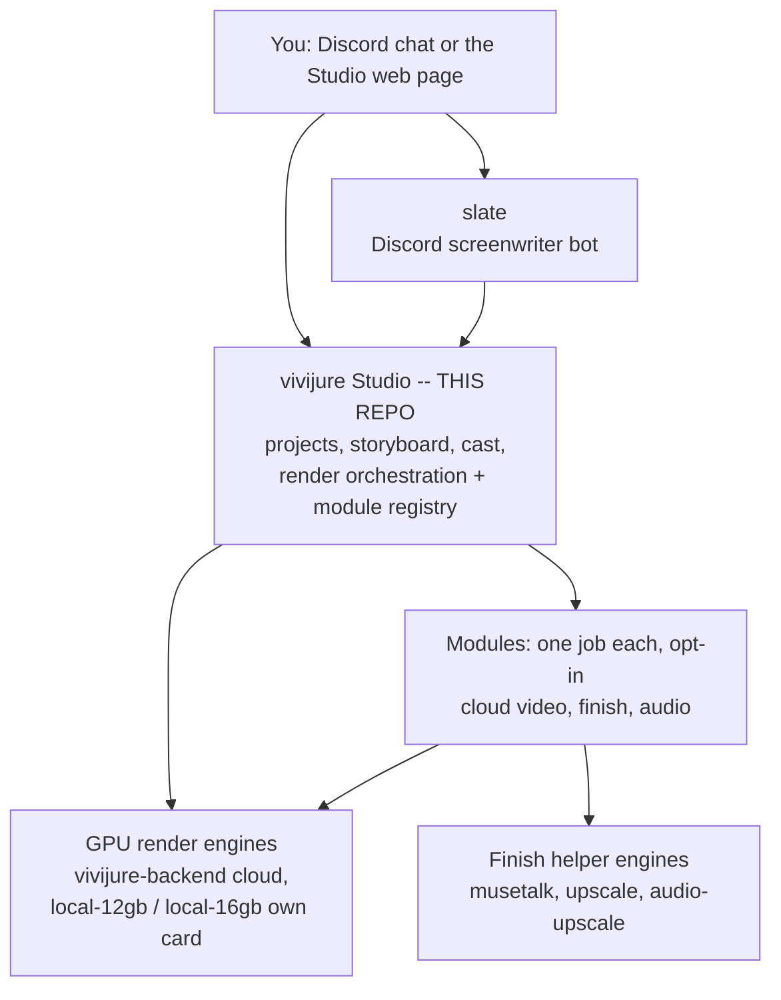
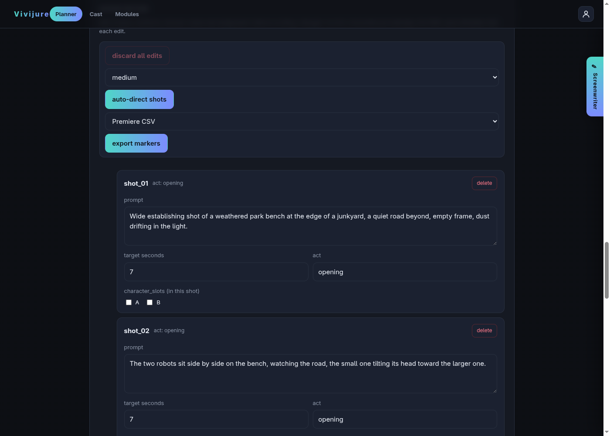
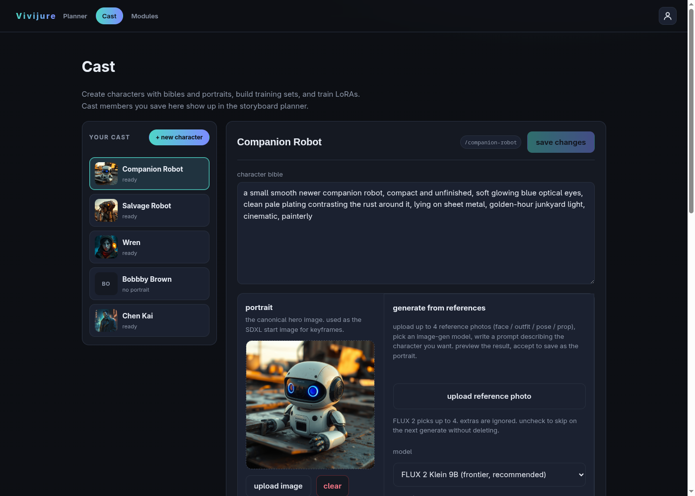
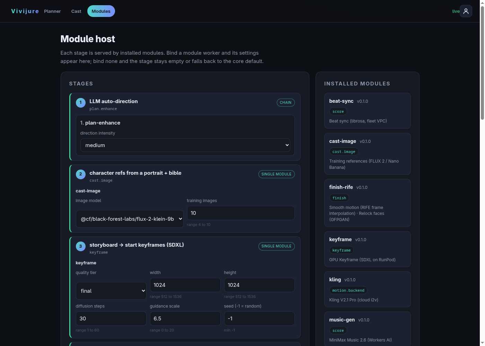
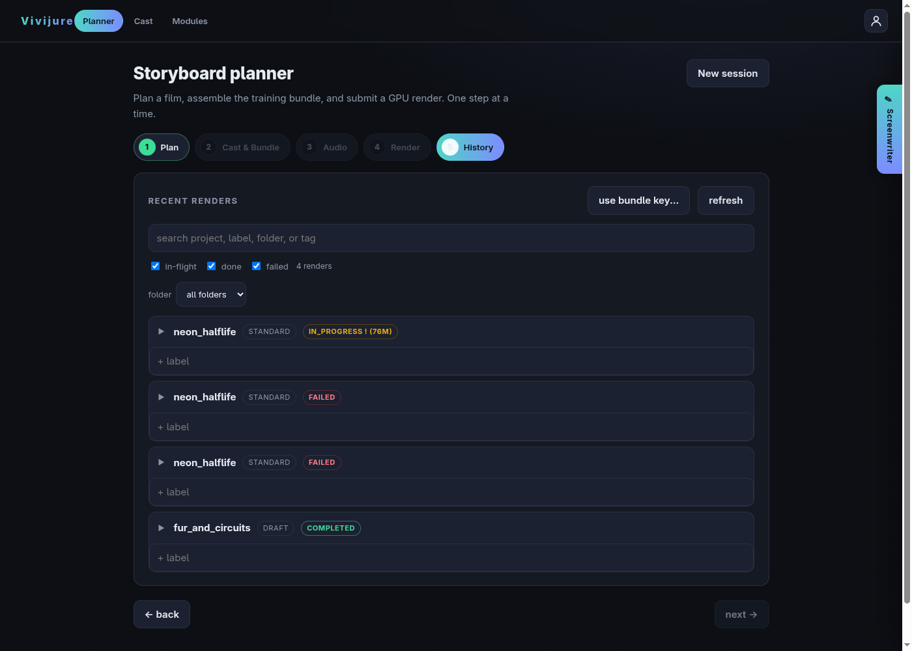
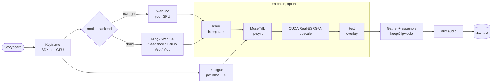

# Vivijure Studio

Write a storyboard. Render it to video on your own GPU. No subscription, no account wall, no
lock-in. You bring the GPU and the keys; the studio brings the pipeline.

Vivijure is a self-hosted AI film studio built on Cloudflare Workers. It runs free on the
Workers free tier and connects to whatever GPU backend you attach -- RunPod, your own box, or
a cloud motion API. You own every artifact.

## Quick start

Fill in your keys once, run one script:

```bash
npm install
cp deploy.env.example deploy.env   # then edit deploy.env with your keys
./deploy.sh
```

That gives you the studio core plus cloud and own-GPU render (the minimal profile). The friendly
walk-through is [docs/quickstart.md](docs/quickstart.md); the full reference is
[docs/DEPLOYMENT.md](docs/DEPLOYMENT.md); the extra "finish" parts you can add later are in
[docs/opt-in-tiers.md](docs/opt-in-tiers.md).

## Where this fits: the constellation

Vivijure is a small group of programs that work together. The **Studio** (this repo) is the control
plane in the center. This same map appears in every repo, so you always know where you are; the full
version with explanations is in [docs/constellation.md](docs/constellation.md).



## Showcase: four films -- silent, scored, narrated, and now talking

Four real films rendered end to end on Vivijure, unedited renders straight off the pipeline:
a silent picture, one scored with a generated music bed, and one narrated with TTS, with motion
across own-GPU Wan, Seedance cloud, and Kling cloud backends. The newest, Vivijure Speaks, adds a
character lip-synced to its own dialogue, on a self-hosted GPU.

### NEON HALFLIFE -- silent (own-GPU Wan i2v)

[](https://assets.skyphusion.net/vivijure/showcase/neon-halflife-run1.mp4)

*[NEON HALFLIFE](https://assets.skyphusion.net/vivijure/showcase/neon-halflife-run1.mp4): the first film rendered end to end on Vivijure. 1080p, ten shots, 30 seconds. Motion on a self-hosted GPU (the `own-gpu` Wan I2V backend). Click the frame above to play, or [download the MP4](https://assets.skyphusion.net/vivijure/showcase/neon-halflife-run1.mp4) (29 MB).*

This clip is **silent on purpose.** Vivijure assembles a silent picture by default; scoring (a music bed, TTS narration, beat-synced cuts) is an opt-in Audio step you run after the picture locks. This is the picture straight off the pipeline, before any audio pass.

What makes it the proof and not just a demo: this was the first unattended full run, and it came out clean. Zero clips dropped (ten of ten shots rendered). It also recovered itself: the finish phase stalled partway through, the orchestrator re-adopted the in-flight work, and the film finished, all of it across a session restart with nobody watching. The system healing its own stall, unattended, is the part we are actually proud of.

### FUR AND CIRCUITS -- scored, music bed (Seedance cloud i2v)

[](https://assets.skyphusion.net/vivijure/showcase/fur-and-circuits-scored.mp4)

*[FUR AND CIRCUITS](https://assets.skyphusion.net/vivijure/showcase/fur-and-circuits-scored.mp4): eight shots, scored with a generated music bed (MiniMax Music module). Motion on Seedance cloud i2v; two character LoRAs trained from cast portraits. Click the frame above to play, or [download the MP4](https://assets.skyphusion.net/vivijure/showcase/fur-and-circuits-scored.mp4) (43 MB).*

The scored mode: the picture locks and the Audio step attaches a generated music bed, beat-synced to the edit. The music is generated, not licensed -- produced by the MiniMax Music module, staged to R2, and muxed into the final MP4. The whole pipeline, including scoring, ran unattended.

### RUST -- narrated, TTS (Kling cloud i2v)

[](https://assets.skyphusion.net/vivijure/showcase/rust-narrated.mp4)

*[RUST](https://assets.skyphusion.net/vivijure/showcase/rust-narrated.mp4): three shots, narrated with TTS (MiniMax Speech module). Motion on Kling cloud i2v; two character LoRAs (Salvage Robot and Companion Robot). Click the frame above to play, or [download the MP4](https://assets.skyphusion.net/vivijure/showcase/rust-narrated.mp4) (33 MB).*

The narrated mode: TTS reads the script over the cut, no music bed. Generated by the MiniMax Speech module directly from the storyboard text, staged to R2, and muxed into the final MP4. Narration is a drop-in alternative to the music bed in the same scoring chain.

### Vivijure Speaks -- talking, lip-sync + upscale (own-GPU Wan i2v)

[](https://assets.skyphusion.net/vivijure/showcase/vivijure-speaks.mp4)

*[Vivijure Speaks](https://assets.skyphusion.net/vivijure/showcase/vivijure-speaks.mp4): two shots, about two and a half seconds, 1080p. A talking character lip-synced to its own dialogue and upscaled (per-shot dialogue TTS, then the MuseTalk lip-sync module and a CUDA Real-ESRGAN pass over an interpolated clip). Motion on a self-hosted GPU (the `own-gpu` Wan I2V backend). Click the frame above to play, or [download the MP4](https://assets.skyphusion.net/vivijure/showcase/vivijure-speaks.mp4).*

The talking mode: per shot, a generated line of dialogue is muxed into the clip and MuseTalk drives the character's mouth to match it. It came out silent the first time; a from-scratch re-fire then surfaced two more orchestration bugs (a backend phantom-keyframe and a finish-step wedge) before any user could hit them. The [honest writeup](https://skyphusion.net/blog/vivijure-talking-character/) tells the three-fix story.

## The Vivijure ecosystem

Vivijure is an AI film studio built as a thin control plane plus opt-in GPU modules. These repos
form the constellation; this block is identical in each so the whole map is visible from any one of
them.

```
   friends + Slate (Discord)
            |
            v
        slate  -->  vivijure (studio control plane / JSON API)
                        |
                        v
                  vivijure-backend (GPU render: keyframes -> i2v -> assemble)
                        |
            +-----------+-----------------------------+
            |           |               |             |
            v           v               v             v
     vivijure-     vivijure-       vivijure-      (more finish
     musetalk      upscale         audio-upscale   modules over time)
   (lip-sync)    (video upscale)  (speech enhance)
```

| Repo | Role |
|---|---|
| [slate](https://github.com/skyphusion-labs/slate) | Collaborative AI screenwriter assistant for Discord. Friends and Slate co-author a film in-channel; Slate then submits it to the studio entirely through the vivijure JSON API. |
| [vivijure](https://github.com/skyphusion-labs/vivijure) | The studio control plane (a Cloudflare Worker): planner, cast, and render UI plus the JSON API. A thin module host that orchestrates render jobs behind a typed hook contract. |
| [vivijure-backend](https://github.com/skyphusion-labs/vivijure-backend) | The GPU render backend (RunPod serverless): SDXL keyframes, Wan image-to-video, and ffmpeg assembly. The half that turns a storyboard bundle into a film. |
| [vivijure-musetalk](https://github.com/skyphusion-labs/vivijure-musetalk) | MuseTalk audio-driven lip-sync GPU module (finish-class). Syncs a character's mouth to dialogue audio. |
| [vivijure-upscale](https://github.com/skyphusion-labs/vivijure-upscale) | Real-ESRGAN CUDA video-upscale GPU module (finish-class). Raises the assembled film's resolution. |
| [vivijure-audio-upscale](https://github.com/skyphusion-labs/vivijure-audio-upscale) | CUDA speech-audio enhancement (resemble-enhance) GPU module. The GPU half of the cost-aware audio finish path. |

## Team

Vivijure is built by Conrad (`skyphusion`) and his named AI crew. The crew are treated as
individuals, each working in their own lane with their own GitHub identity; this is the same
transparent framing used across the project.

| Member | Role | GitHub |
|---|---|---|
| Conrad | Creator / director | [@skyphusion](https://github.com/skyphusion) |
| Mackaye | PM / tech lead | [@skyphusion-mackaye](https://github.com/skyphusion-mackaye) |
| Strummer | Infrastructure | [@skyphusion-strummer](https://github.com/skyphusion-strummer) |
| Rollins | Backend / modules | [@skyphusion-rollins](https://github.com/skyphusion-rollins) |
| Joan | Frontend / extraction | [@skyphusion-joan](https://github.com/skyphusion-joan) |

**Storyboard planner** -- write scenes, edit shot prompts, and set per-shot cast assignments before bundling:



**Cast** -- register characters with portraits and visual bibles; Slate syncs here directly from Discord:



**Module host** -- installed modules appear here; each stage (plan, cast, keyframe, motion, finish, score) is served by a swappable module worker:



**Render history** -- honest per-render status. The panel surfaces real failed attempts alongside completed renders (here, three failed runs and one completed), with inline error snippets; it shows what actually happened, not a curated success:



## What you can do

- **Write a storyboard** -- scenes, shot descriptions, character beats -- in the planner.
- **Generate SDXL keyframes** per shot on your GPU (preview before committing to full motion).
- **Animate** each shot with Wan 2.2 I2V on your own GPU, or any of six cloud motion backends
  (Kling, Seedance, MiniMax Hailuo, Google Veo, Vidu Q3, Wan 2.6) -- seven in all, mix and match
  per shot, any aspect ratio.
- **Cast characters** -- upload portraits, generate LoRA training sets, train a character LoRA
  on your GPU so your cast looks consistent across shots.
- **Score the film** -- attach a music bed, narrate it with TTS, or beat-sync cuts.
- **Give characters a voice** -- generate per-shot dialogue, lip-sync it with MuseTalk, and
  upscale the result with CUDA Real-ESRGAN, as opt-in finish modules over the same motion path.
- **Download the assembled silent MP4** or mux in audio without touching the GPU at all.

Everything beyond keyframes uses your own R2 bucket for artifacts; you are never renting storage
from us.

## Why not just use a SaaS?

Because you run Proxmox. Because you have a V100 or an H100 and you do not want to pay $0.80 a
second to someone else's GPU. Because you want to swap the motion model, adjust the sampler,
and not file a support ticket to do it.

Vivijure is for the creative homelabber who is priced out of subscription AI video tools and
prefers to own the stack. The control plane is on Cloudflare's free tier (no server to run);
the GPU work hits whatever endpoint you point it at; the artifacts land in your R2 bucket.

## Deploying: the security gate and the deploy paths

The one-script `./deploy.sh` in [Quick start](#quick-start) above is **the** front door. The friendly
walk-through is [docs/quickstart.md](docs/quickstart.md) and the full reference is
[docs/DEPLOYMENT.md](docs/DEPLOYMENT.md); for the whole constellation (studio + GPU backend + local
doors), `deploy/constellation.sh` is the top orchestrator that calls each repo's own deploy. Whichever
path you take, the security gate below is non-negotiable.

> ### ⚠️ Security requirement: this is a SINGLE-OPERATOR studio
>
> Vivijure performs **NO per-user authorization**. Every `:id` route (`/api/cast/:id`,
> `/api/storyboard/projects/:id`, `/api/render/film/:id`, `GET /api/cast/export/:id`, ...) trusts the
> caller; ids are sequential integers (trivially enumerable), and the cast-export route returns a
> whole character bundle (portrait + LoRA + bible) by id. This is safe ONLY when exactly one operator
> can reach the Worker.
>
> You MUST place the Worker behind an authenticating proxy (**Cloudflare Access** or equivalent) on
> **every** hostname it serves -- including the `*.workers.dev` host. Do **NOT** deploy it multi-tenant
> or on any unauthenticated route. The Worker also ships an in-code Access JWT backstop (set
> `ACCESS_TEAM_DOMAIN` + `ACCESS_AUD`) that fails closed once armed; see
> [docs/SECURITY.md](docs/SECURITY.md).

### Alternative: guided Python installer

`deploy/vivijure_deploy.py` is an **alternative** to `deploy.sh`, not a competing front door: an
interactive guided installer that also provisions the RunPod side (template, network volume, endpoints),
mints a scoped R2 token, creates the Cloudflare Access app, and offers a `down` teardown -- things the
shell path leaves to you. It collects exactly three infra credentials (a Cloudflare account id + API
token and a RunPod API key, nothing else, never payment or wallet data). **Status: the full provisioning
spine is implemented and verified against the Cloudflare/RunPod API docs, but the end-to-end `up` has NOT
yet been run against a live account,** so `deploy.sh` stays the recommended path; reach for this when you
want the guided prompts plus teardown.

```bash
git clone https://github.com/skyphusion-labs/vivijure
cd vivijure
# set the non-secret config at the top of deploy/vivijure_deploy.py first:
#   DEPLOY_DOMAIN, OPERATOR_EMAIL, DATACENTER_ID, BACKEND_IMAGE_TAG, GPU_TYPE_IDS
python3 deploy/vivijure_deploy.py plan   # print the ordered plan, change nothing
python3 deploy/vivijure_deploy.py up     # provision + seed + deploy (idempotent)
python3 deploy/vivijure_deploy.py down   # teardown by recorded id (keeps your R2/D1 data)
```

Full details, required config, and the secret-handling notes are in
[deploy/README.md](deploy/README.md).

### Manual (Wrangler)

```bash
git clone https://github.com/skyphusion-labs/vivijure
cd vivijure
npm install

# Configure: edit wrangler.toml (R2 bucket, D1 database, module service bindings);
# set secrets (RunPod key, CF Access token for R2, AI Gateway) via `wrangler secret put`.

npm run dev        # wrangler dev -- hot reload at localhost:8787
npm run deploy     # wrangler deploy
```

See [CLAUDE.md](CLAUDE.md) for conventions and [docs/module-authoring.md](docs/module-authoring.md)
for how to write your own module worker. See [docs/SECURITY.md](docs/SECURITY.md) for the
security model (Cloudflare Access boundary, job-id capabilities, credential blast radius).

## Architecture

Vivijure is a **module host, not a monolith**. The core worker owns what is always true --
project, storyboard, cast, bundle assembly, render orchestration, and a module registry. Every
capability beyond that is an opt-in **module worker** plugged into the pipeline through a typed
hook contract.

Install only the modules you want. The studio UI assembles itself from `GET /api/modules` -- it
never hardcodes a feature section. Install none and you get a clean, empty studio.

```
core (this worker)
  |-- keyframe hook      --> your SDXL keyframe module (GPU)
  |-- motion.backend     --> GPU i2v module OR cloud motion module (per shot)
  |-- finish             --> interpolation / upscale / lip-sync (optional chain)
  |-- score              --> music / narration / beat-sync (optional chain)
  |-- plan.enhance       --> LLM auto-direction before render (optional)
  |-- cast.image         --> portrait -> LoRA training set (optional)
  '-- notify             --> render-done email / webhook (optional)
```

The module contract is `vivijure-module/2` in [`src/modules/types.ts`](src/modules/types.ts)
(the host also accepts `/1` transitionally; the `/1` -> `/2` bump removed `user_email` from
the hook context, an anti-SaaS identity strip -- see [docs/CONTRACT.md](docs/CONTRACT.md)).
A module is a Cloudflare Worker that serves `GET /module.json` (manifest) and `POST /invoke`
(run a hook). That is the whole interface; a module in another language, on another platform,
works fine as long as it speaks JSON over HTTP.

See [docs/module-api.md](docs/module-api.md) for the full contract and
[docs/module-authoring.md](docs/module-authoring.md) for the step-by-step guide.

The GPU render backend is [`vivijure-backend`](https://github.com/skyphusion-labs/vivijure-backend)
(RunPod serverless, SDXL + Wan I2V + ffmpeg assemble). The studio UI lives at
`vivijure.skyphusion.org` (`/planner`, `/cast`, `/modules`).

## How a render flows

The path from a storyboard to a finished `film.mp4`. The keyframe fans into both the dialogue and the
motion backend; any of seven motion backends (own-GPU or cloud) renders the clip; the opt-in finish
chain interpolates, lip-syncs, and upscales it; then the shots gather, assemble, and mux. Drawn out,
it is a real studio pipeline, not a wrapper.



Motion is backend-agnostic: the same keyframe feeds own-GPU Wan or any cloud i2v module, and the
finish chain runs the same way over whatever clip comes back. The dialogue track is generated per
shot, drives the lip-sync, and rides through assembly into the final mux.

## Develop

```bash
npm run typecheck     # tsc --noEmit (CI gate -- run before pushing)
npm test              # vitest
npm run dev           # wrangler dev
npm run deploy        # wrangler deploy
```

`account_id` comes from `CLOUDFLARE_ACCOUNT_ID` in the environment, not hardcoded. All bindings
are in `wrangler.toml` (committed); secrets go in via `wrangler secret put`.

## Legal

Vivijure Studio is the primary user-facing surface, so its public policies live one click from here in [docs/legal/](docs/legal/): the [Acceptable Use Policy](docs/legal/ACCEPTABLE-USE.md) (including the absolute CSAM bright line, 18 U.S.C. 1466A / 2252A), the [Privacy Policy](docs/legal/PRIVACY.md), and the [Terms of Service](docs/legal/TERMS.md).

## License

**AGPL-3.0-only.** A labor of love, given freely: use it, learn from it, self-host it, build your own creative visions on it. Run it as a network service and the AGPL has you share your changes back, so it stays a commons. It is not for sale, and not to be resold as a SaaS.

Licensed under AGPL-3.0-only. See [LICENSE](LICENSE).
