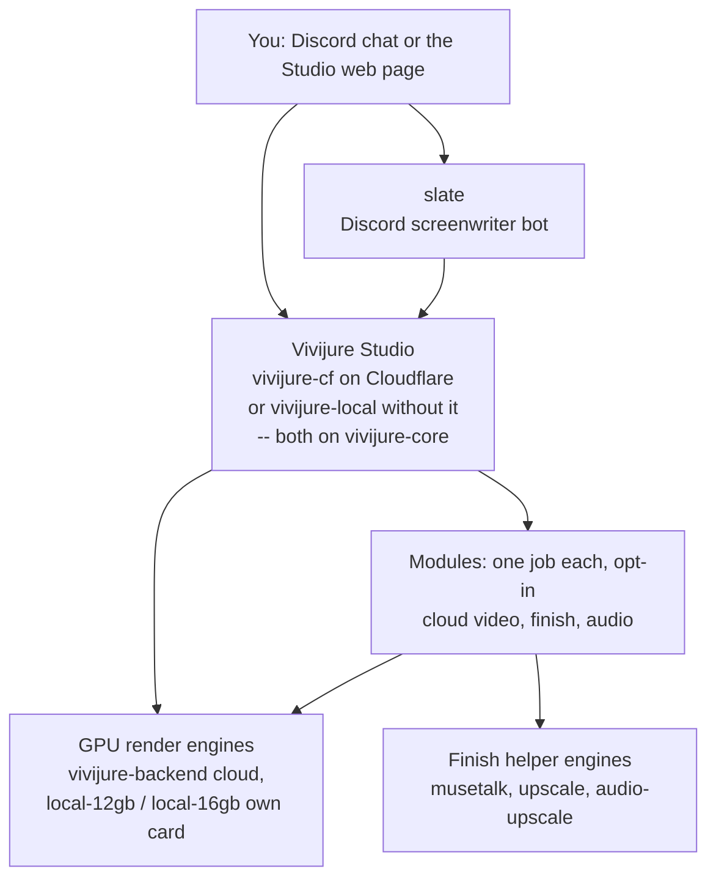

# Vivijure

**Write a storyboard. Render it to video on your own GPU. No subscription, no account wall, no
lock-in.** You bring the GPU and the keys; the studio brings the pipeline. You own every artifact.

Vivijure is a self-hosted, AGPL AI film studio. Run the control panel on the Cloudflare Workers free
tier ([vivijure-cf](https://github.com/skyphusion-labs/vivijure-cf)), or on a home computer / any
cloud server ([vivijure-local](https://github.com/skyphusion-labs/vivijure-local)); both share
[vivijure-core](https://github.com/skyphusion-labs/vivijure-core). Connect whatever GPU backend you
attach -- RunPod, your own box, or a cloud motion API.

> **This repo is the constellation map -- the front door to every part of Vivijure.** The studio
> itself and each render engine live in their own repos, linked below. Looking for the code you
> deploy? That is **[vivijure-cf](https://github.com/skyphusion-labs/vivijure-cf)**.

**Live:** https://vivijure.com · **Demo:** https://demo.vivijure.com · **Skyphusion Labs:** https://skyphusion.org

## Start here

| I want to... | Go to |
|---|---|
| **Run the studio on Cloudflare** (the standard path) | **[vivijure-cf](https://github.com/skyphusion-labs/vivijure-cf)** |
| **Run the studio without Cloudflare** (Node + SQLite + S3/MinIO) | **[vivijure-local](https://github.com/skyphusion-labs/vivijure-local)** |
| **Write screenplays in Discord**, then hand off to the studio | **[slate](https://github.com/skyphusion-labs/slate)** |
| **Drive the studio from an AI agent** (MCP) | **[vivijure-mcp](https://github.com/skyphusion-labs/vivijure-mcp)** |
| **Render on a rented cloud GPU** (RunPod) | **[vivijure-backend](https://github.com/skyphusion-labs/vivijure-backend)** |
| **Render on my own consumer card** | **[vivijure-local-12gb](https://github.com/skyphusion-labs/vivijure-local-12gb)** (LTX, 12GB) · **[vivijure-local-16gb](https://github.com/skyphusion-labs/vivijure-local-16gb)** (CogVideoX, 16GB) |

## Where it fits: the constellation

Vivijure is a small group of programs that work together. The **Studio** is the control plane in the
center; every render engine and finish helper plugs into it. This same map appears in every repo, so
you always know where you are.

## Every repo

**Run the studio**

| Repo | What it is |
|---|---|
| **[vivijure-cf](https://github.com/skyphusion-labs/vivijure-cf)** | **The studio, on Cloudflare Workers** -- the control plane: projects, storyboard, cast, render orchestration, the module registry, and the self-assembling UI. Pairs with `vivijure-core`. **This is the code you deploy.** |
| [vivijure-core](https://github.com/skyphusion-labs/vivijure-core) | The shared orchestration library (`@skyphusion-labs/vivijure-core` on npm) both hosts build on -- the host-neutral core. |
| [vivijure-local](https://github.com/skyphusion-labs/vivijure-local) | The same studio **without Cloudflare** -- Node + SQLite + S3/MinIO + Hono. Own the whole stack. |

**Render engines**

| Repo | What it is |
|---|---|
| [vivijure-backend](https://github.com/skyphusion-labs/vivijure-backend) | Cloud GPU render engine on RunPod: SDXL keyframes, Wan image-to-video, LoRA training, ffmpeg film assembly. |
| [vivijure-local-12gb](https://github.com/skyphusion-labs/vivijure-local-12gb) | Homelab render door: LTX-Video i2v on a 12GB card. Motion with no cloud rent. |
| [vivijure-local-16gb](https://github.com/skyphusion-labs/vivijure-local-16gb) | Higher-fidelity homelab door: CogVideoX-5B i2v on a 16GB card. |

**Finish engines (opt-in)**

| Repo | What it is |
|---|---|
| [vivijure-musetalk](https://github.com/skyphusion-labs/vivijure-musetalk) | MuseTalk audio-driven lip-sync (talking heads), on RunPod GPU. |
| [vivijure-upscale](https://github.com/skyphusion-labs/vivijure-upscale) | Real-ESRGAN CUDA video upscale, on RunPod serverless GPU. |
| [vivijure-audio-upscale](https://github.com/skyphusion-labs/vivijure-audio-upscale) | resemble-enhance speech enhancement. |

**Front doors**

| Repo | What it is |
|---|---|
| [slate](https://github.com/skyphusion-labs/slate) | Collaborative AI screenwriter for Discord: develop a storyboard in chat, hand it to the studio. |
| [vivijure-mcp](https://github.com/skyphusion-labs/vivijure-mcp) | Drive the studio from any MCP client (Claude Code, Cursor, ...): plan, cast, submit a render, poll to done. |
| [vivijure-com](https://github.com/skyphusion-labs/vivijure-com) | The promotional site and showcase at [vivijure.com](https://vivijure.com). |

## What it is

Vivijure is a **module host, not a monolith.** The core owns what is always true -- project,
storyboard, cast, bundle assembly, render orchestration, and a module registry. Every capability
beyond that is an opt-in **module worker** plugged in through a typed hook contract
(`vivijure-module/2`). The studio UI assembles itself from `GET /api/modules`; install none and you
get a clean, empty studio. The full contract and the module-authoring guide live in
[vivijure-cf/docs](https://github.com/skyphusion-labs/vivijure-cf/tree/main/docs).

## Showcase: four films -- silent, scored, narrated, and now talking

Four real films rendered end to end on Vivijure, unedited renders straight off the pipeline:
a silent picture, one scored with a generated music bed, and one narrated with TTS, with motion
across own-GPU Wan, Seedance cloud, and Kling cloud backends. The newest, Vivijure Speaks, adds a
character lip-synced to its own dialogue, on a self-hosted GPU.

### NEON HALFLIFE -- silent (own-GPU Wan i2v)

*[NEON HALFLIFE](https://assets.skyphusion.net/vivijure/showcase/neon-halflife-run1.mp4): the first film rendered end to end on Vivijure. 1080p, ten shots, 30 seconds. Motion on a self-hosted GPU (the `own-gpu` Wan I2V backend). Click the frame above to play, or [download the MP4](https://assets.skyphusion.net/vivijure/showcase/neon-halflife-run1.mp4) (29 MB).*

This clip is **silent on purpose.** Vivijure assembles a silent picture by default; scoring (a music bed, TTS narration, beat-synced cuts) is an opt-in Audio step you run after the picture locks. This is the picture straight off the pipeline, before any audio pass.

What makes it the proof and not just a demo: this was the first unattended full run, and it came out clean. Zero clips dropped (ten of ten shots rendered). It also recovered itself: the finish phase stalled partway through, the orchestrator re-adopted the in-flight work, and the film finished, all of it across a session restart with nobody watching. The system healing its own stall, unattended, is the part we are actually proud of.

### FUR AND CIRCUITS -- scored, music bed (Seedance cloud i2v)

*[FUR AND CIRCUITS](https://assets.skyphusion.net/vivijure/showcase/fur-and-circuits-scored.mp4): eight shots, scored with a generated music bed (MiniMax Music module). Motion on Seedance cloud i2v; two character LoRAs trained from cast portraits. Click the frame above to play, or [download the MP4](https://assets.skyphusion.net/vivijure/showcase/fur-and-circuits-scored.mp4) (43 MB).*

The scored mode: the picture locks and the Audio step attaches a generated music bed, beat-synced to the edit. The music is generated, not licensed -- produced by the MiniMax Music module, staged to R2, and muxed into the final MP4. The whole pipeline, including scoring, ran unattended.

### RUST -- narrated, TTS (Kling cloud i2v)

*[RUST](https://assets.skyphusion.net/vivijure/showcase/rust-narrated.mp4): three shots, narrated with TTS (MiniMax Speech module). Motion on Kling cloud i2v; two character LoRAs (Salvage Robot and Companion Robot). Click the frame above to play, or [download the MP4](https://assets.skyphusion.net/vivijure/showcase/rust-narrated.mp4) (33 MB).*

The narrated mode: TTS reads the script over the cut, no music bed. Generated by the MiniMax Speech module directly from the storyboard text, staged to R2, and muxed into the final MP4. Narration is a drop-in alternative to the music bed in the same scoring chain.

### Vivijure Speaks -- talking, lip-sync + upscale (own-GPU Wan i2v)

*[Vivijure Speaks](https://assets.skyphusion.net/vivijure/showcase/vivijure-speaks.mp4): two shots, about two and a half seconds, 1080p. A talking character lip-synced to its own dialogue and upscaled (per-shot dialogue TTS, then the MuseTalk lip-sync module and a CUDA Real-ESRGAN pass over an interpolated clip). Motion on a self-hosted GPU (the `own-gpu` Wan I2V backend). Click the frame above to play, or [download the MP4](https://assets.skyphusion.net/vivijure/showcase/vivijure-speaks.mp4).*

The talking mode: per shot, a generated line of dialogue is muxed into the clip and MuseTalk drives the character's mouth to match it. It came out silent the first time; a from-scratch re-fire then surfaced two more orchestration bugs (a backend phantom-keyframe and a finish-step wedge) before any user could hit them. The [honest writeup](https://skyphusion.net/blog/vivijure-talking-character/) tells the three-fix story.

## How a render flows

The path from a storyboard to a finished `film.mp4`. The keyframe fans into both the dialogue and the
motion backend; any of seven motion backends (own-GPU or cloud) renders the clip; the opt-in finish
chain interpolates, lip-syncs, and upscales it; then the shots gather, assemble, and mux. Drawn out,
it is a real studio pipeline, not a wrapper.

Motion is backend-agnostic: the same keyframe feeds own-GPU Wan or any cloud i2v module, and the
finish chain runs the same way over whatever clip comes back. The dialogue track is generated per
shot, drives the lip-sync, and rides through assembly into the final mux.

## Legal

Vivijure's public policies live in the studio repo, one click away:
[Acceptable Use Policy](https://github.com/skyphusion-labs/vivijure-cf/blob/main/docs/legal/ACCEPTABLE-USE.md)
(including the absolute CSAM bright line, 18 U.S.C. 1466A / 2252A), the
[Privacy Policy](https://github.com/skyphusion-labs/vivijure-cf/blob/main/docs/legal/PRIVACY.md),
and the [Terms of Service](https://github.com/skyphusion-labs/vivijure-cf/blob/main/docs/legal/TERMS.md).

## Support

Questions, bugs, or ideas? This repo's [GitHub Issues](../../issues) are the general front door;
for a bug in a specific part, open it on that repo's issues. See [SUPPORT.md](SUPPORT.md) for how to
ask. Found a security problem? Report it privately per [SECURITY.md](SECURITY.md), never as a public
issue.

## License

**AGPL-3.0-only.** A labor of love, given freely: use it, learn from it, self-host it, build your own
creative visions on it. Run it as a network service and the AGPL has you share your changes back, so
it stays a commons. It is not for sale, and not to be resold as a SaaS. See [LICENSE](LICENSE).
