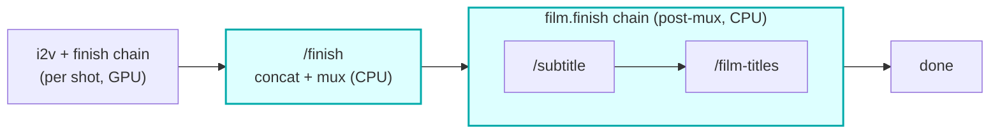

# video-finish

A CPU/ffmpeg **HTTP container** reached over Workers VPC by the core and the `film.finish` modules. It
is the **off-GPU tail of the render pipeline**: it concatenates the per-shot clips into the final film,
muxes the audio bed, and serves the `film.finish` text routes (overlay, title/credit cards, subtitles).
Stateless and credentialless -- the Worker presigns short-lived R2 GET/PUT URLs and passes them in the
request body, so bytes never touch the Worker and the container holds no R2 binding or secrets.

## Where it fits

After motion/i2v and the per-shot finish chain produce the finished clips, the core calls `/finish` to
concat them (hard cut or film-style xfade) and mux the soundtrack into the MP4. Post-mux, the
`film.finish` chain calls back into this same container: `/subtitle` (burn captions), then
`/film-titles` (title + credit cards); `/overlay` is available for arbitrary text cards. Doing this on a
cheap CPU container replaces the GPU-billed `assemble.py` seconds the old pod used (GPU money is for GPU
work only).

The seam is presigned R2: the Worker hands the container GET URLs for the per-shot clips (in order) and
an optional soundtrack, plus a PUT URL for the result. The container reads/writes R2 itself; the Worker
keeps the credentials.

## HTTP contract

| Route | Method | Purpose |
|---|---|---|
| `/health` | GET | readiness probe (`{ok:true}`); does not shell out to ffmpeg |
| `/finish` | POST | concat per-shot clips (cut/xfade) + mux soundtrack -> final MP4 |
| `/overlay` | POST | burn a text overlay / card onto the film |
| `/film-titles` | POST | prepend a title card + append credit cards |
| `/subtitle` | POST | burn time-synced captions (and/or emit a soft `.srt` sidecar) |

Every route takes presigned R2 URLs (GET inputs, PUT output) in a small JSON body and returns
`{ ok, ... }`. Failures are returned as data (`{ ok: false, error }`), never thrown across the wire.

## DSP

ffmpeg, CPU-only: per-clip normalize (scale/pad to WxH, fps, libx264), concat (hard cut or xfade
crossfade), audio mux (aac, `-shortest`). Captions burn via libass; title/credit cards via
drawtext/overlay. The DSP mirrors the old `vivijure-serverless` `assemble.py` so output matches what the
pod produced.

## Operations

- compose service `video-finish` on `127.0.0.1:8780:8000`, joined to the `vivijure` docker network.
- Bindings: `VIDEO_FINISH_VPC` on the core (assemble/mux) and on `modules/subtitle` + `modules/film-titles`
  (the `film.finish` routes). Service host name MUST match the compose service name.
- Deploy on your container host: `docker compose -p vivijure-media -f containers/compose.yaml up -d --build video-finish`;
  health: `curl http://127.0.0.1:8780/health`.

## Soft-degrade

The `film.finish` routes are polish steps: a container failure degrades to the un-captioned / un-titled
film (recorded with `degraded`, never a fake "applied" tag, never silent), so a polish miss never drops a
rendered film. `/finish` is load-bearing -- a concat/mux failure fails the assemble (there is no film
without it).

## License

**AGPL-3.0-only.** A labor of love, given freely: use it, learn from it, self-host it, build your own creative visions on it. Run it as a network service and the AGPL has you share your changes back, so it stays a commons. It is not for sale, and not to be resold as a SaaS.

## POST /inspect (#523 Layer 2 content validation)

Read-only pixel-content inspection. The studio Worker cannot decode video; this endpoint runs ffmpeg on
a rendered clip to catch the noise class the in-Worker structural gate (Layer 1) cannot. Presigned GET
URLs only; bytes never touch the Worker; no PUT (inspection is side-effect-free).

Request body:

| Field | Type | Req | Meaning |
|-------|------|-----|---------|
| `clipUrl` | string | yes | Presigned GET URL for the clip (mp4). |
| `keyframeUrl` | string | no | Presigned GET URL for the conditioning keyframe (PNG). When present, enables the confident first-frame-vs-keyframe similarity check. |

Response `200 { ok: true, verdict, reason, metrics, keyframe_similarity }`:

- `verdict` -- `ok` | `suspect` (chromatic-noise heuristic, warn) | `corrupt` (keyframe mismatch, confident).
- `metrics` -- `sat_mean`, `gray_std_mean`, `chroma_structure_ratio`, `frames`.
- `keyframe_similarity` -- normalized first-frame-vs-keyframe luma correlation in [0,1], or null when no keyframe.

`400` on missing `clipUrl` / invalid JSON, `413` on an over-cap clip, `502` on a fetch failure, `500` on an
ffmpeg/inspect error. Thresholds + rationale live in `inspect_core.py` (unit-tested by `test_inspect.py`).
