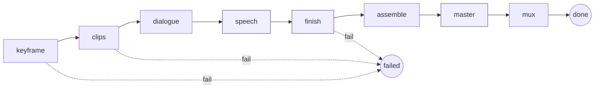

# Vivijure Studio: Frontend <-> Backend Contract (ICD)

This document is the **complete** interface-control reference for the Vivijure Studio worker. It is
authored so the FULL contract schema -- every HTTP route, every hook input/output, every manifest
field, every projection rule -- can be reproduced faithfully WITHOUT opening a single `.ts` file.

Every shape here is transcribed from a canonical source in the tree (`src/index.ts` router,
`src/modules/types.ts`, `src/modules/registry.ts`, `src/modules/conformance.ts`,
`src/film-orchestrator.ts`, `src/render-module-config.ts`, `src/voices.ts`). Where a field is
optional the contract marks it optional; where the core defaults it, the default is stated.

Contract version: **`vivijure-module/1`** (the `MODULE_API` constant). It bumps only on a breaking
change to the hook or manifest shapes.

Conventions in this doc:
- "R2 key" = an object key in the `R2_RENDERS` bucket (the studio's render store).
- "presigned GET / PUT" = a time-limited signed URL the core mints so a module (or a browser) can
  fetch / upload an R2 object directly without bucket credentials.
- A double hyphen `--` stands in for a dash (house style: no em/en dashes).

---

## 1. Overview: the module-host model

Vivijure Studio is **not** a monolith. It is a thin **module host**: a Cloudflare Worker that owns
the render API, the planner/cast UI, and job orchestration, plus a typed **hook contract** that
opt-in **module workers** plug into. The core invokes hooks; it does not know who answers. Each
module is a separate Worker that:

1. Serves `GET /module.json` -- its **manifest** (which hooks it serves, its config knobs, UI hints).
2. Serves `POST /invoke` -- the single entry point the core calls to run a hook.
3. Optionally serves `POST /poll` -- for async (long-running) work.

The core discovers modules from its env bindings, fetches each manifest, and builds a **registry**.

> **The frontend is a projection of the registry.** The studio UI does not hardcode the pipeline. It
> reads `GET /api/modules` and renders the panels, choosers, and config controls from that payload.
> Install a module (bind it) and it appears in the UI; remove it and it disappears. There is one
> source of truth (the registry), and the frontend is a view of it.

There are **11 hooks** (extension points). A hook is either:
- **`pick_one`** -- exactly one installed module serves it (rendered as a chooser), or
- **`chain`** -- every installed module serving it runs in order, each consuming the previous output
  (rendered as stacked config blocks).

A module failure is **data, never an exception across the wire**: a module returns `{ ok: false }`
and the core degrades; it does not crash. Polish steps (finish, speech, score, master, film.finish)
soft-degrade (pass their input through honestly with a `degraded` reason) rather than fail the
render. Only malformed I/O fails loud.

### Auth model

The studio is **single-user**. All studio data lives under a fixed owner (`STUDIO_OWNER = "studio"`);
`getUserEmail()` returns that constant and is NOT an access gate. The Cloudflare Access identity
header `cf-access-authenticated-user-email` is read only for provenance / per-user settings
(`/api/whoami`, `/api/prefs`) and for the `notify` hook; a missing header reads as `"anonymous"`.
Access gating itself is enforced at the edge (CF Access), not in the worker.

---

## 2. HTTP API routes (frontend -> backend)

### 2.0 Dispatch + global behavior

- `GET /health` -> `200 { "ok": true, "service": "vivijure-studio", "phase": 1 }`.
- `GET /api/modules` is handled inline (with a 60s per-isolate discovery cache); see 2.1.
- Studio HTML/JS/CSS pages are served from the `ASSETS` binding for `GET`/`HEAD`.
- All other API routes dispatch through the `API_ROUTES` table (method + path pattern -> handler).
- Path patterns use `:param` (single segment) and `*param` (greedy, captures the rest, e.g. an R2 key
  with slashes).
- Errors: a handler throwing `HttpError` returns `{ "error": "<message>" }` with that status (e.g.
  `badRequest` -> 400, `notFound` -> 404). An uncaught error returns `500 { "error": "internal error" }`.
- Success bodies are JSON unless noted (artifact + marker export return raw bytes).
- A `:id` for a film job is the `film-<...>` id; render-library ids are numeric.

### 2.1 Full route enumeration

Every route the worker serves that the frontend (or an API client such as the Slate/Discord bot)
calls. Contract-critical routes have a detailed schema in 2.2+.

| # | Method | Path | Purpose |
|---|--------|------|---------|
| 1 | GET | `/health` | Liveness probe. |
| 2 | GET | `/api/modules` | **The projection payload** the frontend renders the pipeline from (catalog, hooks, modules, render tiers). See 2.2. |
| 3 | GET | `/api/voices` | Dialogue voice catalog (Aura-1 speakers). See 2.3. |
| 4 | GET | `/api/storyboard/projects` | List storyboard projects. |
| 5 | POST | `/api/storyboard/projects` | Create a project. Body `{ name?, prefs?, storyboard? }`. |
| 6 | GET | `/api/storyboard/projects/:id` | Get one project (with last storyboard). |
| 7 | PATCH | `/api/storyboard/projects/:id` | Update name / prefs / storyboard. |
| 8 | POST | `/api/storyboard/projects/:id/storyboard` | Save the project's storyboard. Body `{ storyboard }`. |
| 9 | DELETE | `/api/storyboard/projects/:id` | Delete a project. |
| 10 | GET | `/api/cast` | List cast members. `{ cast: CastRow[] }`. |
| 11 | POST | `/api/cast` | Create a cast member. Body `{ name, bible? }`. |
| 12 | GET | `/api/cast/:id` | Get one cast member. `{ cast: CastRow }`. |
| 13 | PATCH | `/api/cast/:id` | Update `{ name?, bible?, voice_id? }` (voice_id validated). |
| 14 | DELETE | `/api/cast/:id` | Delete a cast member. `{ ok, deleted }`. |
| 15 | POST | `/api/cast/:id/portrait` | Set portrait (binary upload, `{key,mime}`, or `{from_chat_artifact}`). |
| 16 | DELETE | `/api/cast/:id/portrait` | Clear the portrait. |
| 17 | POST | `/api/cast/:id/ref` | Add a training reference image. |
| 18 | DELETE | `/api/cast/:id/ref` (or `/refs/*refKey`) | Remove a reference image by key. |
| 19 | POST | `/api/cast/:id/source` | Add a human-uploaded source photo. |
| 20 | DELETE | `/api/cast/:id/source` (or `/source/*sourceKey`) | Remove a source photo by key. |
| 21 | POST | `/api/cast/:id/generate-refs` | Start the `cast.image` ref-generation job. See 2.6. |
| 22 | GET | `/api/cast/:id/refs-job/:jobId` | Poll the ref-generation job. See 2.6. |
| 23 | POST | `/api/cast/:id/train-lora` | Start cast LoRA training. |
| 24 | GET | `/api/cast/:id/lora-status` | Poll cast LoRA training status. |
| 25 | POST | `/api/upload` | Upload raw image bytes -> `{ key, mime, size }`. See 2.7. |
| 26 | GET | `/api/artifact/*key` | Serve an R2 object by key (no-cache-ish). See 2.4. |
| 27 | POST | `/api/storyboard/preflight` | Pre-render validation of a storyboard. |
| 28 | POST | `/api/storyboard/plan` | LLM plan a storyboard from a brief. |
| 29 | POST | `/api/storyboard/refine` | LLM refine an existing storyboard. |
| 30 | POST | `/api/chat` | Planner chat assistant. |
| 31 | POST | `/api/storyboard/score-bed` (alias `/music-generate`) | Generate a music/score bed (async). |
| 32 | GET | `/api/job/:id` | Poll a score-bed generation job. |
| 33 | POST | `/api/storyboard/enhance` | Run the `plan.enhance` chain (auto-direction). See 2.5. |
| 34 | GET | `/api/storyboard/models` | List planner LLM models. `{ models }`. |
| 35 | POST | `/api/storyboard/yaml` | Serialize a storyboard to YAML. `{ ok, yaml }`. |
| 36 | POST | `/api/storyboard/markers` | Export timeline markers (raw file download). |
| 37 | POST | `/api/storyboard/bundle` | Assemble a render bundle tarball. `{ ok, bundleKey, ... }`. |
| 38 | POST | `/api/storyboard/audio-upload` | Upload an audio bed -> `{ key, mime, size }`. |
| 39 | POST | `/api/storyboard/character-ref` | Upload a character ref image -> `{ key, mime, size }`. |
| 40 | POST | `/api/audio/analyze` | Analyze audio beats. `{ ok, output, module }`. |
| 41 | POST | `/api/storyboard/render` | Submit a module-path render (keyframe + motion). See 2.8. |
| 42 | POST | `/api/storyboard/render-plan` | Dry-run: resolve the render pipeline without submitting. |
| 43 | POST | `/api/render/clips` | Start a per-shot clips job. |
| 44 | GET | `/api/render/clips/:id` | Poll a clips job. |
| 45 | POST | `/api/render/film` | **Start a full film job.** See 2.9. |
| 46 | GET | `/api/render/film/:id` | **Poll a film job** (FilmSummary). See 2.10. |
| 47 | POST | `/api/storyboard/renders/:id/regen-shot` | Regenerate a single shot. |
| 48 | POST | `/api/storyboard/render/scatter` | Scatter (sharded) render submission. |
| 49 | POST | `/api/storyboard/render-from-keyframes` | Animate from injected keyframes. See 2.8. |
| 50 | GET | `/api/storyboard/render/:jobId` | Poll a storyboard render (RunPod-shaped view). See 2.8. |
| 51 | DELETE | `/api/storyboard/render/:jobId` | Cancel a render. |
| 52 | GET | `/api/storyboard/renders` | List renders (`?project_id`, `?limit`). `{ renders }`. |
| 53 | GET | `/api/storyboard/renders/tags` | List render tags. `{ tags }`. |
| 54 | PATCH | `/api/storyboard/renders/:id` | Update label / lockedShots / folderPath / tags. |
| 55 | DELETE | `/api/storyboard/renders/:id` | Delete a render. |
| 56 | POST | `/api/storyboard/renders/:id/add-audio` | Mux an audio bed onto a finished render. |
| 57 | POST | `/api/storyboard/renders/:id/add-narration` | Add narration to a finished render. |
| 58 | POST | `/api/storyboard/renders/:id/finalize` | Finalize a keyframes-only preview (GPU animate). |
| 59 | POST | `/api/storyboard/renders/:id/animate-cloud` | Animate a preview via cloud i2v. |
| 60 | POST | `/api/storyboard/renders/:id/animate-hybrid` | Animate a preview via mixed GPU/cloud backends. |
| 61 | POST | `/api/storyboard/renders/adopt` | Adopt an externally-produced render into history. |
| 62 | GET | `/api/whoami` | CF Access identity. `{ user }`. |
| 63 | GET | `/api/prefs` | Get per-user prefs. `{ ok, prefs }`. |
| 64 | PATCH | `/api/prefs` | Update per-user prefs. `{ ok, prefs }`. |

### 2.2 GET /api/modules -- the projection payload

The single payload the frontend renders the whole pipeline from. Unauthenticated-safe: the internal
env `binding` that serves each hook is **stripped** (info-disclosure guard). Cached 60s per isolate.

**Request:** no params, no body.

**Response 200** (`ModulesResponse`):

| Field | Type | Meaning |
|-------|------|---------|
| `api` | `"vivijure-module/1"` | Contract version. |
| `modules` | `PublicModule[]` | Every installed module's manifest, **minus** `binding`. Each is the manifest shape from section 4. |
| `hooks` | `{ [hook]: string[] }` | Map of hook name -> module **names** serving it, **pre-sorted** in canonical `ui.order` then name order (section 5). The frontend consumes this verbatim and never re-sorts. |
| `catalog` | `HookCatalogEntry[]` | Every hook (independent of what is installed): `{ name, blurb, cardinality }`. Source: `HOOK_NAMES` x `HOOK_BLURBS` x `HOOK_CARDINALITY`. |
| `render` | `RenderConfigProjection` | Core-owned render config: `{ quality_tiers: { value, label, blurb }[], default_tier }`. See 2.2.1. |

`HookCatalogEntry`: `{ name: HookName, blurb: string, cardinality: "pick_one" | "chain" }`.

`PublicModule` = the `ModuleManifest` (section 4) with `binding` removed.

#### 2.2.1 render.quality_tiers (canonical values)

Sourced from `QUALITY_TIERS` / `DEFAULT_QUALITY_TIER`. `default_tier` = `"final"`.

| value | label | blurb |
|-------|-------|-------|
| `draft` | draft | 33 frames, 8 steps; fastest, lowest quality |
| `standard` | standard | 8-step keyframes + 20-step EasyCache i2v; balanced |
| `final` | final | 97 frames, 22 steps; production quality |

### 2.3 GET /api/voices

**Request:** none.
**Response 200:** `{ "voices": { "id": string, "label": string }[] }`.

The catalog is the Aura-1 speakers, in this stable order (the `id` set): `angus`, `asteria`, `arcas`,
`orion`, `orpheus`, `athena`, `luna`, `zeus`, `perseus`, `helios`, `hera`, `stella`. The cast voice
picker renders from this; one source of truth.

### 2.4 GET /api/artifact/*key

Serve an R2 object by its key (the `*key` captures the full slashed key).

**Request:** path = the R2 key (e.g. `renders/film-abc/film.mp4`). No body.
**Response 200:** raw object bytes. Headers: `content-type` (from the object's stored metadata, else
`application/octet-stream`), `content-length`, `cache-control: private, max-age=300`.
**404** `{ "error": "artifact not found" }` if the key is missing.

> Render outputs mutate (a render can re-finish in place), so artifact serving is deliberately
> conservative caching. History-preview bursts limit concurrency client-side, not via long caching.

### 2.5 POST /api/storyboard/enhance -- run the plan.enhance chain

Runs the `plan.enhance` **chain** (LLM auto-direction) over a storyboard.

**Request body:**

| Field | Type | Required | Meaning |
|-------|------|----------|---------|
| `storyboard` | `PlanEnhanceStoryboard` | yes | Must have a `scenes[]`; structural passthrough (modules rewrite `scenes[].prompt`, preserve all else). |
| `brief` | string | no | The original brief, for context. |
| `project` | string | no | Project id (defaults to `"enhance"`). |
| `config` | object | no | Config passed to each chain module. |

**Response 200:**

| Field | Type | Meaning |
|-------|------|---------|
| `ok` | `true` | |
| `storyboard` | `PlanEnhanceStoryboard` | The enriched storyboard (or the input unchanged if no module ran). |
| `applied` | string[] | Module names that ran, in order. |
| `errors` | string[] | Chain errors (skipped / failed modules). |
| `notes` | string[] | Human-readable notes from the modules. |

### 2.6 Cast ref generation (cast.image)

Async run/poll across requests (a multi-image set cannot finish in one request).

**POST `/api/cast/:id/generate-refs`** -- start. Body:

| Field | Type | Required | Meaning |
|-------|------|----------|---------|
| `config` | object | no | Module config overrides. |
| `art_style` | string | no | Art-style lead (e.g. `"anime"`); blank keeps photographic templates. |
| `source_keys` | string[] | no | R2 keys of human-uploaded source photos (extra conditioning). |
| `choice` | string | no | Module selection when several `cast.image` modules exist. |

Response `201 { ok: true, ...castRefsSummary }` (job id + status + progress). `404` if the cast member
is unknown.

**GET `/api/cast/:id/refs-job/:jobId`** -- advance + poll. Response `200 { ok: true, ...castRefsSummary }`.
`404` if the job is unknown.

### 2.7 POST /api/upload

Upload raw image bytes (the body IS the bytes; `Content-Type` is the image mime).

**Request:** raw bytes; `Content-Type` one of `image/png|jpeg|webp|gif`. Max 25 MB.
**Response 201:** `{ "key": string, "mime": string, "size": number }`. The key is then registered on a
cast member via the portrait/ref/source routes.
**400** on empty body or over-size.

Siblings: `POST /api/storyboard/audio-upload` (audio mimes, max 32 MB) and
`POST /api/storyboard/character-ref` (image, max 25 MB), each returning the same `{ key, mime, size }`.

### 2.8 The storyboard render path (module render bridge)

`POST /api/storyboard/render` (`hSubmitRender`) submits a render through the **module pipeline**
(keyframe + motion). `POST /api/storyboard/render-from-keyframes` animates from injected keyframes.
Both return, and `GET /api/storyboard/render/:jobId` polls, a **RunPod-shaped poll view** so the
planner's existing poll loop understands a module render identically to a raw RunPod job.

**POST `/api/storyboard/render` body:**

| Field | Type | Required | Meaning |
|-------|------|----------|---------|
| `bundleKey` | string | yes | R2 key of the render bundle (storyboard + cast refs/LoRAs). |
| `project` | string | no | Defaults from the bundle key. |
| `qualityTier` | `"draft"\|"standard"\|"final"` | no | Defaults `"final"`. Injected into keyframe + motion configs. |
| `renderOverrides` | object | no | Per-module config overrides; see 2.8.1. |
| `keyframesOnly` | bool | no | Stop after keyframes (preview), no i2v/assemble. |
| `audioKey` | string | no | Staged audio bed to mux after assemble (ignored when `keyframesOnly`). |
| `processShotIds` | string[] | no | Subset of shots to render. |
| `projectId` | number/string | no | History project id. |
| `scenes` | `FilmScene[]` | yes | Storyboard shots: `{ shot_id, prompt, seconds }` (normalized; `seconds` defaults 4). |
| `motion_backend` | string | no | Explicit motion module choice (else resolved from overrides). |
| `castLoras` | `{ [slot]: cast_id }` | no | Bound cast LoRAs. A bound-but-not-ready LoRA **fails hard** (no silent inline retrain). |

Guards: `503` if no `keyframe` module is installed; `400` if a full render has no `motion.backend`
module; `400` if `scenes[]` is empty; `400` (untrained cast message) if a bound cast LoRA is not ready.

**Response 201:** the RunPod-shaped poll view (2.8.2).

**POST `/api/storyboard/render-from-keyframes` body:** `{ bundleKey (req), project?, qualityTier?,
renderOverrides?, audioKey?, projectId?, motion_backend? }`. Reads scenes + injected keyframes from
the bundle. `503` if no `motion.backend`; `400` if the bundle has no scenes or no injected keyframes;
`422` if the job fails to start.

#### 2.8.1 renderOverrides shape

Two accepted forms (both parsed by `parseModuleRenderOverrides`):

1. **Module wire form** (canonical): `{ motion_backend?: string, config?: { [moduleName]: { ...knobs } } }`.
   Each `config[moduleName]` is clamped against that module's `config_schema`.
2. **Legacy namespaced form** `{ keyframe, i2v, lora }` (older rows / expert JSON), best-effort mapped:
   - `keyframe`: `{ steps?, guidance_scale?, seed?, resolution? "WxH" }` -> the keyframe module config
     (`resolution` splits to `width`/`height`).
   - `i2v`: `{ fps?, flow_shift?, seed? }` -> the `own-gpu` motion config.
   - `lora`: reserved namespace (cast LoRA envelope; not a render-config knob here).

The core then injects the `quality_tier` into the keyframe module config and `quality` into any
motion module that declares a `quality` knob.

#### 2.8.2 RunPod-shaped poll view (RunpodJobView)

Returned by the storyboard render submit + `GET /api/storyboard/render/:jobId`.

| Field | Type | Meaning |
|-------|------|---------|
| `jobId` | string | The `film-<...>` job id. |
| `status` | `"IN_PROGRESS"\|"COMPLETED"\|"FAILED"\|"CANCELLED"` | Folded from the film phase. |
| `statusRaw` | string | The raw phase (or `"CANCELLED"`). |
| `output` | object \| undefined | On COMPLETED: `{ output_key, project, mode }` (+ `keyframes`/`scenes` for keyframes-only, + `clips`/`model` for derived animation). While IN_PROGRESS: phase progress `{ phase, scene_index, scene_total, project, progress?, last_progress_at, stalled?, stall_seconds? }`. |
| `error` | string \| undefined | Set on FAILED. |
| `executionTimeMs` | number | Wall-clock since job creation. |

### 2.9 POST /api/render/film -- start a film job

The direct film-render entry (used by the planner film render and by API clients such as the Slate
bot). Submits a full job: keyframe -> clips -> (dialogue/speech) -> finish -> assemble -> (master) ->
mux -> (film.finish) -> done.

**Request body:**

| Field | Type | Required | Meaning |
|-------|------|----------|---------|
| `bundle_key` | string | yes | R2 key of the render bundle. |
| `scenes` | `FilmScene[]` | yes | `{ shot_id, prompt, seconds }[]`; non-empty. |
| `project` | string | no | Defaults from the bundle key. |
| `motion_backend` | string | no | Motion module choice. |
| `keyframe_config` | object | no | Keyframe module config. |
| `motion_config` | object | no | Motion module config. |
| `finish_config` | `{ [moduleName]: object }` | no | Per-finish-module config. |
| `audio_key` | string | no | Staged audio bed (score/narration) to mux after assemble. Forwarded to the mux phase; absent => silent film. |
| `film_titles` | `{ title?: { text, subtitle? }, credits?: { lines: string[] } }` | no | Title / credit card text for the `film.finish` chain; absent => no cards. |

Identity: the CF Access email is attached as the film owner (`user_email`) for the `notify` hook.

**Response 201:** `{ ok: true, ...FilmSummary, download_url? }` (see 2.10). A renders-table row is
inserted so the film shows in history.

`FilmScene`: `{ shot_id: string, prompt: string, seconds: number }`.

### 2.10 GET /api/render/film/:id -- poll a film job

Advances the job one tick and returns its summary. Keeps the history row in sync.

**Request:** path `:id` = the `film-<...>` id. No body.

**Response 200:** `{ ok: true, ...FilmSummary, download_url? }`:

| Field | Type | Meaning |
|-------|------|---------|
| `film_id` | string | The job id. |
| `phase` | FilmPhase | One of `keyframe, clips, dialogue, speech, finish, assemble, master, mux, done, failed` (section 6). |
| `error` | string \| undefined | Set when `phase === "failed"`. |
| `clips` | `JobSummary` \| undefined | Per-shot clip progress, when a clips job exists. |
| `finish` | `{ total, done, failed, pending }` \| undefined | Finish-chain progress, when finish shots exist. |
| `film_key` | string \| undefined | R2 key of the assembled film, present once `phase === "done"`. |
| `download_url` | string \| undefined | Presigned GET of the finished film (24h), added only when `phase === "done"` and `film_key` is set. |

**404** `{ "error": "film job not found" }` for an unknown id.

---

## 3. The 11 hooks

The hooks are the typed contract between the core and module workers. Source of truth: `HOOK_NAMES`,
`HOOK_CARDINALITY`, `HOOK_BLURBS`, and the `*Input` / `*Output` interfaces in `src/modules/types.ts`.
The core invokes a hook with `InvokeRequest { hook, input, config, context }` and reads back
`InvokeResponse` (sync `{ ok:true, output }`, async `{ ok:true, pending:true, poll }`, or
`{ ok:false, error }`). Conformance (`src/modules/conformance.ts`) enforces the REQUIRED output fields
per hook; optional hint fields are not demanded.

### 3.0 Hook summary

| Hook | Cardinality | Blurb |
|------|-------------|-------|
| `keyframe` | pick_one | storyboard -> start keyframes (SDXL) |
| `motion.backend` | pick_one | keyframe -> shot clip (GPU or cloud) |
| `finish` | chain | interpolation / upscale / face restore |
| `score` | chain | music / narration / beat-sync |
| `dialogue` | pick_one | spoken lines -> per-character voice (TTS) |
| `speech` | chain | clean / enhance dialogue audio |
| `plan.enhance` | chain | LLM auto-direction |
| `cast.image` | pick_one | character refs from a portrait + bible |
| `notify` | chain | render-complete notification (email / webhook) |
| `master` | chain | film-level audio mastering: music upscale + loudness |
| `film.finish` | chain | title / credit cards on the finished film |

Legend for the field tables: `?` after a field name = optional.

### 3.1 keyframe (pick_one)

Project-level pass: trains/reuses cast LoRAs once and emits every shot's start keyframe in one GPU job.

**KeyframeInput**

| Field | Type | Req | Meaning |
|-------|------|-----|---------|
| `project` | string | yes | Project id; also the R2 key prefix the keyframes land under. |
| `bundle_key` | string | yes | R2 key of the project bundle tarball (storyboard + cast refs/LoRAs). |
| `shot_ids?` | string[] | no | Subset to (re)generate; omitted => every shot in the bundle. |
| `pretrained_loras?` | `{ [slot]: string }` | no | slot -> R2 key of pretrained cast LoRAs to reuse. |

**KeyframeOutput** (required: `project`, `keyframes[]` each with `shot_id` + `keyframe_key`)

| Field | Type | Req | Meaning |
|-------|------|-----|---------|
| `project` | string | yes | Echo of the project. |
| `keyframes` | `{ shot_id, keyframe_key }[]` | yes | Each generated start keyframe (PNG R2 key). |
| `trained_loras?` | `{ [slot]: string }` | no | slot -> R2 key of the LoRA this render trained or reused; the core banks it onto the cast member (lora_status=ready). |

### 3.2 motion.backend (pick_one)

Per-shot: turns one start keyframe + motion intent into a clip (GPU or cloud i2v).

**MotionBackendInput**

| Field | Type | Req | Meaning |
|-------|------|-----|---------|
| `shot_id` | string | yes | The shot. |
| `keyframe_url` | string | yes | Presigned, fetchable URL of the start keyframe. |
| `keyframe_key?` | string | no | The underlying R2 key, for reference. |
| `prompt` | string | yes | The motion prompt. |
| `seconds` | number | yes | Clip length. |

**MotionBackendOutput** (required: `shot_id`, `clip_key`, `fps`, `frames`)

| Field | Type | Req | Meaning |
|-------|------|-----|---------|
| `shot_id` | string | yes | The shot. |
| `clip_key` | string | yes | R2 key of the rendered clip (mp4). |
| `fps` | number | yes | Clip fps. |
| `frames` | number | yes | Frame count. |

### 3.3 finish (chain) -- the reference hook

Post-process a clip (interpolation / upscale / face restore). Honest soft-degrade on a miss.

**FinishInput** (the clip is self-describing; the hints are optional)

| Field | Type | Req | Meaning |
|-------|------|-----|---------|
| `shot_id` | string | yes | The shot. |
| `clip_key` | string | yes | R2 key of the input clip (mp4). |
| `audio_key?` | string | no | R2 key of the shot's dialogue audio (TTS); set only for a speaking shot. A lip-sync finish consumes it; others ignore it. Absent => silent shot. |
| `src_fps?` | number | no | Hint; probed if absent. |
| `frames?` | number | no | Hint. |
| `width?` | number | no | Hint. |
| `height?` | number | no | Hint. |

**FinishOutput** (required: `shot_id`, `clip_key`, `out_fps`, `frames`, `applied`)

| Field | Type | Req | Meaning |
|-------|------|-----|---------|
| `shot_id` | string | yes | The shot. |
| `clip_key` | string | yes | R2 key of the FINISHED clip (may equal the input if it no-op'd). |
| `out_fps` | number | yes | Output fps. |
| `frames` | number | yes | Output frame count (duration is invariant). |
| `applied` | string[] | yes | e.g. `["interpolate:2x","face_restore:gfpgan"]`; or `["passthrough:<reason>"]` / `["noop:nothing-enabled"]`. |
| `degraded?` | string | no | Set ONLY when the clip was passed through because the finish could not run; carries the reason. A real degrade is never silent (#77). |

### 3.4 score (chain)

Add audio (music / narration / beat-sync) to the assembled film.

**ScoreInput**

| Field | Type | Req | Meaning |
|-------|------|-----|---------|
| `film_key` | string | yes | R2 key of the silent film (mp4). |
| `seconds` | number | yes | Film length. |
| `storyboard?` | `PlanEnhanceStoryboard` | no | Optional context for mood/tempo. |

**ScoreOutput** (required: `film_key`, `applied`)

| Field | Type | Req | Meaning |
|-------|------|-----|---------|
| `film_key` | string | yes | R2 key of the scored film (mp4). |
| `applied` | string[] | yes | e.g. `["music:minimax","narration:tts"]`. |

### 3.5 dialogue (pick_one)

Synthesize every speaking shot's line in ONE batch (one submit+poll for a film's dialogue).

**DialogueLine**: `{ shot_id: string, text: string, voice_id?: string }` (voice resolved by the core).

**DialogueInput**

| Field | Type | Req | Meaning |
|-------|------|-----|---------|
| `project` | string | yes | R2 key prefix the audio lands under. |
| `lines` | `DialogueLine[]` | yes | Every speaking shot's line. |

**DialogueOutput** (required: `project`, `audio[]` each `shot_id`+`audio_key`+`voice_id`, `applied`)

| Field | Type | Req | Meaning |
|-------|------|-----|---------|
| `project` | string | yes | Echo. |
| `audio` | `{ shot_id, audio_key, voice_id }[]` | yes | Per-line synthesized audio (R2 key + voice used). The core attaches `audio_key` to that shot's FinishInput. |
| `applied` | string[] | yes | What it did. |

### 3.6 speech (chain)

Clean / enhance one shot's dialogue audio. Runs AFTER dialogue, BEFORE finish. Polish step: never
fails the render on a miss.

**SpeechInput**: `{ shot_id: string, audio_key: string }` (R2 key of the shot's dialogue audio).

**SpeechOutput** (required: `shot_id`, `audio_key`, `applied`)

| Field | Type | Req | Meaning |
|-------|------|-----|---------|
| `shot_id` | string | yes | The shot. |
| `audio_key` | string | yes | NEW cleaned key on enhancement, or the input key passed through on a soft-degrade. |
| `applied` | string[] | yes | e.g. `["speech-upscale:resemble-enhance"]`; or `[]` on passthrough. |
| `degraded?` | string | no | Set ONLY when passed through (disabled / backend down / no audio); the reason. |

### 3.7 plan.enhance (chain)

Enrich a storyboard before render (LLM auto-direction). Structural passthrough: a module rewrites
`scenes[].prompt`, preserving every other field.

**PlanEnhanceScene**: `{ prompt: string, [k]: unknown }`.
**PlanEnhanceStoryboard**: `{ scenes: PlanEnhanceScene[], [k]: unknown }`.

**PlanEnhanceInput**

| Field | Type | Req | Meaning |
|-------|------|-----|---------|
| `storyboard` | `PlanEnhanceStoryboard` | yes | The storyboard to enrich. |
| `brief?` | string | no | Original brief for context. |

**PlanEnhanceOutput** (required: `storyboard` with a `scenes[]`)

| Field | Type | Req | Meaning |
|-------|------|-----|---------|
| `storyboard` | `PlanEnhanceStoryboard` | yes | The enriched storyboard. |
| `notes?` | string[] | no | Human-readable notes on what it did. |

### 3.8 cast.image (pick_one)

Cast-prep: generate LoRA training reference images from a portrait + bible. Upstream of keyframe.

**CastImageInput**

| Field | Type | Req | Meaning |
|-------|------|-----|---------|
| `cast_id` | number | yes | The cast member. |
| `portrait_url` | string | yes | Presigned URL of the portrait (the generation seed). |
| `portrait_key?` | string | no | The underlying R2 key. |
| `source_urls?` | string[] | no | Presigned URLs of human-uploaded reference photos (extra conditioning). |
| `bible?` | string | no | Character bible/description; composed into each prompt (capped). |
| `art_style?` | string | no | Art-style lead (e.g. `"anime"`); blank keeps photographic templates. |

**CastImageOutput** (required: `cast_id` (number), `images[]` each `key`+`mime`, `applied`)

| Field | Type | Req | Meaning |
|-------|------|-----|---------|
| `cast_id` | number | yes | Echo. |
| `images` | `{ key, mime }[]` | yes | R2 keys of the generated reference images. |
| `applied` | string[] | yes | e.g. `["model:flux-2-klein-9b","generated:10"]`. |

### 3.9 notify (chain)

Terminal side-effect hook: fired once on the done-transition. Every installed notifier delivers
independently. A notifier with nothing to do returns an empty `delivered`, never an error.

**NotifyInput**

| Field | Type | Req | Meaning |
|-------|------|-----|---------|
| `event` | `"render.complete"` | yes | The completion event. |
| `film_id` | string | yes | The film. |
| `project` | string | yes | Project name. |
| `download_url?` | string | no | Presigned link to the finished film. |
| `seconds?` | number | no | Film length, if known. |
| `user_email?` | string | no | The owner's address (for an email notifier). |

**NotifyOutput**: `{ delivered: string[] }` (required) -- e.g. `["email:owner@example.com"]`.

### 3.10 master (chain)

Film-level audio mastering: polish the assembled film's audio BED (music upscale + LUFS loudness)
AFTER the mix, BEFORE the mux. Audio sibling of `finish`. Honest soft-degrade.

**MasterInput**

| Field | Type | Req | Meaning |
|-------|------|-----|---------|
| `film_id` | string | yes | The film (for the output-key convention + logs). |
| `audio_key` | string | yes | R2 key of the assembled audio bed (the mix to master). |
| `seconds?` | number | no | Film length hint; probed if absent. |

**MasterOutput** (required: `audio_key`, `applied`)

| Field | Type | Req | Meaning |
|-------|------|-----|---------|
| `audio_key` | string | yes | R2 key of the MASTERED bed (may equal the input on passthrough / no-op). |
| `applied` | string[] | yes | e.g. `["music-upscale:soxr48k","loudnorm:-14LUFS"]`; or `["passthrough:<reason>"]`. |
| `degraded?` | string | no | Set ONLY when passed through because the master could not run; the reason (#77). |

### 3.11 film.finish (chain)

Post-mux, before done: put title / credit cards (and/or subtitles) on the finished film, by R2
transport. FAIL-SAFE: a step that cannot run passes the film through (never drops a rendered film).
The chain presigns a FRESH GET (of the prior step's film) + PUT (to a new key) per step so step N+1
reads what step N wrote, not the original (#14).

**FilmFinishInput**

| Field | Type | Req | Meaning |
|-------|------|-----|---------|
| `film_key` | string | yes | R2 key of the input film (the prior step's output, or the original on step 1). |
| `video_url` | string | yes | Presigned GET of the input film (the module fetches it). |
| `output_url` | string | yes | Presigned PUT the module writes the carded film to. |
| `output_key` | string | yes | The R2 key behind `output_url`. |
| `title?` | `{ text: string, subtitle?: string }` | no | Opening title card text; absent => no title card. |
| `credits?` | `{ lines: string[] }` | no | End-credit lines; absent => no credit card. |
| `captions` | `{ start: number, end: number, text: string }[]` | yes | Time-synced dialogue cues (FilmFinishCaption[]); empty => the subtitle module no-ops. |
| `sidecar_url` | string | yes | Presigned PUT for an optional `.srt` subtitle sidecar (ignored by non-subtitle modules). |
| `sidecar_key` | string | yes | The R2 key behind `sidecar_url`. |

**FilmFinishOutput** (conformance requires: `film_key` string)

| Field | Type | Req | Meaning |
|-------|------|-----|---------|
| `film_key?` | string | yes (per conformance) | R2 key of the carded film; omitted / unchanged => passed through (no new film). |
| `applied?` | string[] | no | Module name on success; `"passthrough:<reason>"` / `"noop:no-cards"` on a soft-degrade. |
| `degraded?` | string | no | Set ONLY when the film shipped UNCARDED, carrying the reason -- the one signal cards were NOT applied (#207). |

> Note: `FilmFinishCaption` (`{ start, end, text }`) is declared in the contract so a module in another
> repo vendoring `types.ts` gets the caption shape without importing a core-only module.

---

## 4. Module manifest schema (vivijure-module/1)

A module serves its manifest at `GET /module.json`. The core validates it (`validateManifest`) and the
conformance harness (`checkManifest`) proves a candidate module honors it.

**ModuleManifest**

| Field | Type | Req | Meaning |
|-------|------|-----|---------|
| `name` | string | yes | Unique module id. |
| `version` | string | yes | Module version. |
| `api` | `"vivijure-module/1"` | yes | Contract version (must equal `MODULE_API`). |
| `hooks` | `HookName[]` | yes | The hooks this module serves (must be known hook names). |
| `provides?` | `{ id: string, label: string }[]` | no | User-facing capabilities (each needs `id` + `label`). |
| `config_schema?` | `{ [field]: ConfigField }` | no | The knobs the module exposes; the UI renders controls from these and the core clamps the user's value against them before invoking. |
| `ui?` | `{ section?: string, icon?: string, order?: number }` | no | Self-assembling-UI hints. `order` is the fold/render order within a chain hook (default 100). |

Internal-only (NEVER on the wire): `RegisteredModule = ModuleManifest & { binding: string }`. The
`binding` (the env binding that serves the module) is stripped to `PublicModule` for `GET /api/modules`.

### 4.1 ConfigField types

A `config_schema` field is one of (validated by `checkConfigField`; valid types are
`int, float, bool, enum, string`):

| type | shape | notes |
|------|-------|-------|
| `int` | `{ type:"int", default:number, min?, max?, label?, enum_labels? }` | default must be a number. |
| `float` | `{ type:"float", default:number, min?, max?, label?, enum_labels? }` | default must be a number. |
| `bool` | `{ type:"bool", default:boolean, label? }` | default must be a boolean. |
| `enum` | `{ type:"enum", values:string[], default:string, label? }` | `values` non-empty; default must be one of `values`. |
| `string` | `{ type:"string", default:string, label? }` | default must be a string. |

> An `array` ConfigField type is a **planned addition** to the contract (not yet present); only the
> five types above are valid today.

### 4.2 Example manifest (verbatim, finish-rife)

```json
{
  "name": "finish-rife",
  "version": "0.1.0",
  "api": "vivijure-module/1",
  "hooks": ["finish"],
  "provides": [
    { "id": "interpolate", "label": "Smooth motion (RIFE frame interpolation)" },
    { "id": "face_restore", "label": "Relock faces (GFPGAN)" }
  ],
  "config_schema": {
    "interpolate":          { "type": "bool",  "default": true },
    "interpolation_factor": { "type": "int",   "default": 2, "min": 1, "max": 8 },
    "face_restore":         { "type": "enum",  "values": ["none", "gfpgan", "codeformer"], "default": "none" },
    "face_fidelity":        { "type": "float", "default": 0.7, "min": 0, "max": 1 },
    "only_faces":           { "type": "bool",  "default": true }
  }
}
```

### 4.3 Invocation envelopes

The core POSTs to a module's `/invoke`:

```
InvokeRequest = { hook: HookName, input: <hook input>, config: { ...validated knobs }, context: InvokeContext }
InvokeContext = { project: string, job_id: string, user_email?: string }   // never secrets
```

The module returns one of:

```
{ ok: true, output: <hook output> }            // synchronous: done
{ ok: true, pending: true, poll: string }       // async: accepted; POST /poll with this token
{ ok: false, error: string }                    // failure is DATA, not an exception
```

For async work the core POSTs `{ poll: string }` to the module's `/poll` until it returns
`{ ok:true, output }` (done) or `{ ok:false, error }` (failed); `{ ok:true, pending:true }` means keep
polling.

---

## 5. Projection + ordering rules

How the frontend derives the UI from the registry. **The frontend never re-sorts and never hardcodes
the pipeline** -- it consumes `GET /api/modules` verbatim.

**(a) One canonical sort, server-side.** `registry.ts indexByHook` orders modules within each hook by:

```
(a.ui.order ?? 100) - (b.ui.order ?? 100)  ||  a.name.localeCompare(b.name)
```

`data.hooks[hook]` is shipped **pre-sorted** in exactly that order. The same comparator backs
`servingForHook` (the dispatch order), so the order the frontend renders is byte-for-byte the order the
core folds a chain in. Module order is therefore guaranteed identical everywhere.

**(b) Where each hook surfaces.** Hooks that render in the planner's render-config panel:
`keyframe`, `motion.backend`, `speech`, `finish`, `master`, `film.finish`. The rest project onto
**bespoke surfaces** (the "skip-set" for the render panel):

| Hook | Surface |
|------|---------|
| `dialogue` | storyboard (per-shot lines) |
| `score` | audio-bed |
| `plan.enhance` | auto-direct |
| `cast.image` | cast page |
| `notify` | a toggle |

**(c) Cardinality renders the control.** A `pick_one` hook renders as a **chooser** (one module
selected). A `chain` hook renders as **stacked config blocks** (every installed module, each with its
`config_schema` controls), folded in `ui.order`.

---

## 6. Render lifecycle

A film job moves through these phases in order (the `FilmJob.phase` union):

```
keyframe -> clips -> dialogue -> speech -> finish -> assemble -> master -> mux -> done
                                                                              (+ failed at any point)
```



- **Pollable phases** (advanced one tick per `GET /api/render/film/:id`, with stall recovery):
  `keyframe`, `clips`, `finish`, `assemble`, `mux`. `dialogue` and `speech` advance via their module
  poll tokens between clips and finish.
- **`plan.enhance` and `film.finish` are CHAINS, not parked phases.** They run via `dispatchChain`:
  - `plan.enhance` runs synchronously on `POST /api/storyboard/enhance` (pre-render), not inside the
    film job.
  - `film.finish` runs at the `transitionToDone` step (post-mux), then the job marks `done` and fires
    `notify`. `dispatchChain` presigns fresh GET/PUT/sidecar URLs per step (so step N+1 reads what step
    N wrote, #14), and records the chain outcome (`applied`, `errors`, `degraded`) onto the job so a
    degraded run (e.g. cards requested but the container was unreachable) is observable state, not a
    silent green.
- **Soft-degrade discipline:** the polish phases (`finish`, `speech`, `score`, `master`,
  `film.finish`) never fail the render on a miss; they pass their input through and record a `degraded`
  reason. Structural failures (a keyframe / motion / assemble failure) fail loud to `failed`.
- **Conditional phases:** `dialogue`/`speech` run only when there are dialogue lines; `master` runs
  only when there is an `audio_key` AND a `master` module is installed; `mux` runs only when there is
  both a silent film and an audio bed; `film.finish` runs only when a `film.finish` module is
  installed (else the assembled film keeps its key).
- **Done output:** once `phase === "done"`, `film_key` is set and `GET /api/render/film/:id` adds a
  presigned `download_url` (24h). `notify` fires once on the done-transition.

---

## Source-of-truth index

| Concern | Canonical file |
|---------|----------------|
| Hook names / cardinality / blurbs, all hook I/O, manifest + ConfigField, invoke envelopes | `src/modules/types.ts` |
| Registry projection (`indexByHook`, `hookCatalog`, `modulesResponse`, `toPublic`), dispatch (`dispatchChain`, `dispatchPickOne`, `servingForHook`) | `src/modules/registry.ts` |
| Conformance checks (manifest, invoke response, per-hook output) | `src/modules/conformance.ts` |
| Router (`API_ROUTES`), all HTTP handlers, `GET /api/modules` inline | `src/index.ts` |
| Film job (`FilmJob`, phases), `applyFilmFinish`, `transitionToDone`, summaries | `src/film-orchestrator.ts` |
| Render-override parsing, quality tiers, `RenderConfigProjection` | `src/render-module-config.ts` |
| RunPod-shaped poll view, override mapping, scene normalization | `src/film-render-bridge.ts` |
| Voice catalog | `src/voices.ts` |
| Caption cue timing (FilmFinishCaption source) | `src/captions.ts` |
</content>
</invoke>
