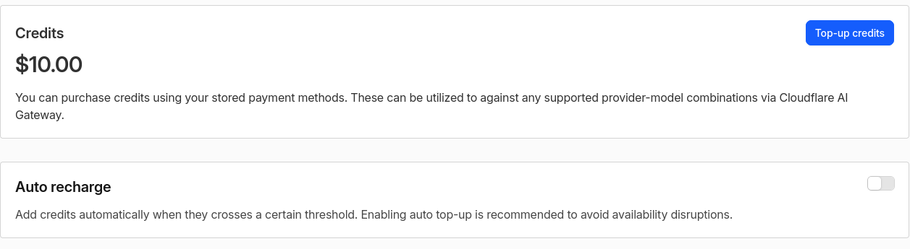
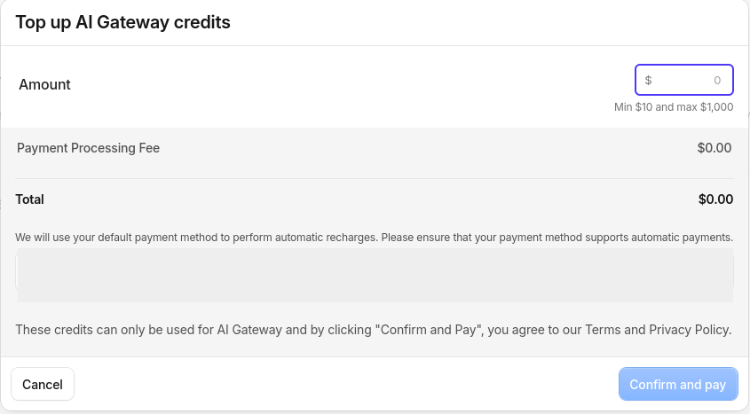

# Deploying Vivijure Studio

This is the start-to-finish guide to stand up your own Vivijure Studio: the API keys you need,
where to get them, exactly what permission each needs and **why**, and the deploy order.

Vivijure has three pieces:

1. **The Studio Worker** (this repo) -- a single Cloudflare Worker that owns projects, storyboards,
   cast, and render orchestration, plus a registry of opt-in **module workers** (one per capability).
2. **The GPU backend** (`vivijure-backend`) -- a container on **RunPod Serverless** that does the
   heavy lifting: LoRA training, SDXL keyframes, image-to-video, lip-sync.
3. **Three CPU helper containers** (`video-finish`, `image-prep`, `audio-beat-sync`) -- ffmpeg/CPU
   work that runs always-on on your own box, reached privately over a Cloudflare VPC binding. Optional
   for a first deploy (the Worker degrades gracefully without the finish container, just no final
   concat/cards).

You do NOT need a separate API key per video provider. Seedance, Kling, MiniMax Hailuo, Google Veo, Vidu, Wan,
keyframes, and lip-sync all run **through RunPod**, so one RunPod key covers them.

---

## ⚠️ Security requirement (read first): SINGLE-OPERATOR, auth-gated

Vivijure is a **single-operator** studio. It does **NO per-user authorization** -- every `:id`
route trusts the caller, and `GET /api/cast/export/:id` returns a full character bundle (portrait +
LoRA + bible) by id. Resource ids are unguessable UUIDs as of S9 (migration 0010, defense-in-depth
against enumeration), but that HARDENS the gate, it does not replace it: any caller who holds an id
still gets the whole bundle. Every deploy MUST therefore run an auth gate. The studio has one BUILT IN; pick the mode with the `AUTH_MODE` worker var:

- **`token` (the quickstart default):** the Worker itself requires
  `Authorization: Bearer <token>` on every `/api/*` request, checked against the
  `STUDIO_API_TOKEN` worker secret with a constant-time compare. `deploy.sh` mints a 256-bit
  random token, stores the secret, and prints the token ONCE at the end of the deploy -- save it.
  The studio UI asks for it on first load and keeps it in your browser only. No Zero Trust
  product, no extra dashboard step. Other consumers (bots, satellites) do NOT reuse this
  operator token: mint each one its own named token with
  `scripts/studio-consumer-token.sh mint <name>` (independently revocable; see
  [SECURITY.md](SECURITY.md) section 1b-i).
- **`access`:** the Worker verifies a Cloudflare Access JWT in-code (fail closed) BEHIND an edge
  Access app you configure -- the recommended hardening for team/org deployments (SSO identity,
  device posture, audit logs). Set `ACCESS_TEAM_DOMAIN` + `ACCESS_AUD` (your Zero Trust team
  hostname + the Access application AUD). See [SECURITY.md](SECURITY.md).

Fail closed either way: no mode, an unknown mode, or token mode without its secret denies every
`/api/*` request (`ALLOW_UNAUTHENTICATED` is the dev-only opt-out, local only). Do **NOT** deploy
multi-tenant or unauthenticated, or any visitor can read and delete every project, cast member,
and film by walking the ids. Hostnames: a custom-domain deploy keeps the `*.workers.dev` host
disabled (`workers_dev = false`), and a `*.workers.dev` `DEPLOY_HOSTNAME` is a supported target --
`deploy.sh` flips `workers_dev = true`, drops the custom-domain route, and the auth gate covers
that host exactly the same way.

---

## One-script deploy (recommended)

The fast path: three steps, ONE dashboard visit.

1. **Create a Cloudflare API token** (section 2a) and gather the rest of your keys: RunPod key +
   endpoint id, R2 S3 keys, AI Gateway slug (sections 2b-2d).
2. **Enable R2** for your account -- a one-time ToS/billing acknowledgement Cloudflare only
   accepts in the dashboard. Open <https://dash.cloudflare.com/?to=/:account/r2> and click
   through the enable screen (the `?to=/:account/...` deep link fills in your account id for
   you; no URL hand-editing).
3. **Run the script** (below). It creates the database and buckets, seeds the module secrets,
   renders the config, deploys everything in the right order (modules before the core), mints
   your studio API token (`AUTH_MODE=token`, the default), and prints that token ONCE at the
   end -- save it. It fails closed if anything is missing.

No Zero Trust / Cloudflare Access setup is required: the built-in token mode is the deploy
default, and Access remains available as optional hardening (`AUTH_MODE=access`, see the security
section above).

```bash
npm ci                             # installs wrangler + deps (deploy.sh checks and does this too)
cp deploy.env.example deploy.env   # then edit deploy.env with your keys
./deploy.sh
```

**One prerequisite the script cannot do for you: enable R2 on the account** (a one-time ToS +
billing acceptance). Do it once at `https://dash.cloudflare.com/<ACCOUNT_ID>/r2` before the first
run; without it the script stops at the bucket step with Cloudflare API code 10042 and prints this
same URL.

`deploy.env` is where all your keys go. It is gitignored -- never commit it. Each line has a short
note on what the value is and where to get it, matching sections 2a-2d below.

Pick a profile with `VIVIJURE_PROFILE` in `deploy.env`:

- **minimal** (the default) -- the studio core plus cloud and own-GPU render. Needs ONLY Cloudflare,
  RunPod, and an AI Gateway. Use this for your first deploy.
- **full** -- also the extra "finish" modules that need your own CPU containers (over a Cloudflare
  VPC) or a second RunPod endpoint: upscale, lip-sync, titles, subtitles, beat-sync, audio-master,
  and speech-upscale.

How the split works: in `wrangler.toml.example`, every opt-in piece is wrapped in a comment-marker
pair, `# >>> OPTIONAL: <name>` ... `# <<< OPTIONAL: <name>`. A minimal deploy strips those blocks so
their bindings cannot dangle and break the deploy; a full deploy keeps them. The opt-in blocks are:
the `tail_consumers` log shipper, the four `[[vpc_services]]` (video-finish / image-prep /
audio-beat-sync / audio-mix), and the eight finish modules named above.

For the whole constellation (studio + GPU backend + local doors), `deploy/constellation.sh` is the
top orchestrator that calls into each repo's own deploy script. Today it drives the studio and stubs
the siblings; the sibling scripts land as those repos are brought up to this standard.

The rest of this guide explains every key and every manual step, so you can run the pieces by hand
or understand exactly what the script does.

---

## 1. Accounts you need

| Provider | What it is | Sign up |
|---|---|---|
| **Cloudflare** | Hosts the Worker + your data (D1, R2, Vectorize) and routes LLM calls (AI Gateway). | dash.cloudflare.com |
| **RunPod** | Serverless GPUs that run the render backend (training, keyframes, i2v, lip-sync). | runpod.io |
| **GitHub** (optional) | Only if you build/host the backend image yourself via GHCR + Actions. | github.com |

Everything bills to your own accounts. The Studio is single-user by design -- one operator, your keys.

---

## 2. The keys, their permissions, and WHY

Issue a **separate, narrowly-scoped key per function** -- never one god-token. If a key leaks or you
rotate it, the blast radius is one function, not your whole account.

### 2a. Cloudflare API token (deploy-time)
Create at **dash.cloudflare.com -> My Profile -> API Tokens -> Create Token -> Custom token**.
Scope it to **your account only** (Account Resources -> Include -> your account).

| Permission | Why it's needed |
|---|---|
| `Account > Workers Scripts > Edit` | Deploy the Studio Worker + every module worker (`wrangler deploy`). |
| `Account > D1 > Edit` | Create the `vivijure-studio` database and apply schema migrations on deploy. |
| `Account > Workers R2 Storage > Edit` | Create + write the two buckets: render outputs (`vivijure`) and the doc/RAG store (`skyphusion-llm`). |
| `Account > AI Gateway > Edit` | Resolve the AI Gateway the LLM features route through, AND enable its **Authenticated Gateway** toggle at deploy (a Unified Billing requirement -- Read cannot flip it). |
| `Account > Account Settings > Read` | `wrangler` reads account metadata at deploy time. |
| `Account > Secrets Store > Edit` | Bind module secrets from the Cloudflare Secrets Store at deploy (the `[[secrets_store_secrets]]` blocks). Binding a store secret to a worker is a write-level association, so READ is NOT enough -- without Edit the deploy fails with `Secrets store binding authorization failed [code: 10021]`. |
| `Account > API Tokens > Edit` (optional) | Lets `deploy.sh` auto-mint the Run-only `CF_AIG_TOKEN` (2d below) so the planner arms with zero extra pastes. Honest trade-off: this scope can mint further API tokens on the account; omit it if that bothers you and paste `CF_AIG_TOKEN` yourself instead. |

> Why so specific: each line maps to a real deploy step below. If a module never touches D1, its
> token never gets D1. This is the whole "least-privilege per function" idea -- you can hand the
> Workers-only token to CI and keep D1/R2 admin off the build runner.
>
> NOTE: `wrangler deploy --dry-run` validates binding CONFIG but does NOT authorize a Secrets
> Store binding against the live API -- only a real deploy does. A dry-run can pass while the deploy
> still 10021s on a token missing `Secrets Store > Edit`. Verify store-backed bindings with a real deploy.

Store it for CI as the repo secret `CLOUDFLARE_API_TOKEN`, plus `CLOUDFLARE_ACCOUNT_ID` (your
account id -- an identifier, not a secret).

### 2b. RunPod API key
Create at **runpod.io -> Settings -> API Keys**. One key with **read/write** (it both *runs* jobs and,
if you let it, *manages* your endpoint).

| Why it's needed |
|---|
| The Studio's GPU modules (`own-gpu`, `keyframe`, `finish-rife`, `finish-upscale`, `finish-lipsync`, and the cloud i2v backends) submit jobs to **your** RunPod Serverless endpoint and poll for results. |

You also need your **endpoint id(s)** (`RUNPOD_ENDPOINT_ID`) -- the id of the Serverless endpoint
running the `vivijure-backend` image (see section 4).

### 2c. R2 S3 access keys (for the GPU backend)
Create at **dash.cloudflare.com -> R2 -> Manage R2 API Tokens -> Create API token**, scoped to
**Object Read & Write** on your render bucket.

| Why it's needed |
|---|
| The RunPod backend is NOT a Cloudflare Worker, so it can't use a Worker R2 binding. It talks to R2 over the S3 API to read inputs (refs, bundles) and write outputs (LoRAs, keyframes, clips). Hence a classic access-key/secret pair, scoped to just the render bucket. |

These become the backend env `R2_ACCESS_KEY_ID` / `R2_SECRET_ACCESS_KEY` (the handler's names;
`scripts/runpod-provision.py` maps your pasted `R2_S3_*` values onto them) (and the matching
RunPod secrets the GPU modules pass through).

### 2d. AI Gateway (LLM features)
The storyboard planner, cast-image prompts, dialogue/music generation, and cloud-animate scoring
route LLM/AI calls through a **Cloudflare AI Gateway** (for caching, rate-limit, and one bill).

- `GATEWAY_ID` -- the gateway slug. **Optional:** leave it blank and `deploy.sh` creates an
  authenticated gateway named `vivijure` for you (needs **AI Gateway: Edit** on your API token); set
  it only to point at an existing gateway (**dash.cloudflare.com -> AI -> AI Gateway**).
- `CF_AIG_TOKEN` -- an AI Gateway authentication token: a Cloudflare API token with
  **AI Gateway: Run** permission. **The core storyboard planner requires it** (every release
  planning model bills through Unified Billing), and the `plan-enhance` module's Opus pass
  uses it too. You can leave it blank in `deploy.env`: `deploy.sh` auto-mints a purpose-named
  Run-only token when the deploy token carries **Account API Tokens: Edit** (see 2a); if it
  cannot, the deploy still completes and the final banner prints the exact steps. To make one
  by hand: dashboard -> AI Gateway -> your gateway -> **Settings** -> **Create authentication
  token** (Run permission), then paste it into `deploy.env` and re-run `./deploy.sh`.
  Unified Billing also requires the gateway's **Authenticated Gateway** toggle ON --
  `deploy.sh` enables it via the API, or the banner tells you to flip it in the same
  Settings page. Run tokens are account-scoped (they cannot be pinned to one gateway).
  Tearing an install down to zero? Also delete the auto-minted `vivijure-planner-aig-run`
  API token: the auto-mint refuses to stack a second token of the same name, so a stale
  twin blocks re-arming on the next deploy.

> Why a gateway instead of a raw provider key: it gives you one place to see spend, cache repeat
> prompts, and swap the underlying model without touching code. Anthropic/other model access is
> billed through Cloudflare's Unified Billing, so you don't manage a separate provider key here.

### 2e. Load AI credits (the planner runs on these)

Unified Billing means no Anthropic/provider key -- storyboard planning spends Cloudflare
**AI credits** on your account. A fresh account has $0.00, and the planner will not run on a
$0.00 balance. The ORDER matters: the credits page only appears once your gateway exists, so
create the gateway (2d) first, then load credits.

1. Dashboard -> **AI** -> **AI Gateway** -> click your gateway. The upper right of the Overview
   shows a dollar chip (next to the **Playground** button):

   

2. Click the chip -- or go straight to
   `https://dash.cloudflare.com/<ACCOUNT_ID>/ai/ai-gateway/credits`. The Credits page shows your
   balance and a **Top-up credits** button. The **Auto recharge** toggle under it is your call:
   on means the planner never dies mid-project on an empty balance; off means no surprise charges.

   

3. Click **Top-up credits**, pick an amount, confirm. Expect a **$10 minimum plus a small
   card-processing fee** (a $10 load invoices about $10.83), charged to the account's default
   payment method.

   

Credits pay for **AI Gateway usage only** (storyboard planning). GPU renders bill your RunPod
account, and storage bills your Cloudflare account, separately.

---

## 3. Deploy the Studio (Cloudflare)

Prereqs: Node 22+, `npm install`, and `npx wrangler login` (or `CLOUDFLARE_API_TOKEN` exported).

```bash
# 3a. Create the data resources (one time)
npx wrangler d1 create vivijure-studio          # then paste the database_id into wrangler.toml
npx wrangler r2 bucket create vivijure           # render outputs (keyframes/clips/films/loras) -- R2_RENDERS
npx wrangler r2 bucket create skyphusion-llm     # document / RAG store -- the R2 binding

# 3b. Set the runtime secrets (prompts for each value)
echo "<your-account-id>"            | npx wrangler secret put CLOUDFLARE_ACCOUNT_ID
# #238: RUNPOD_API_KEY, RUNPOD_ENDPOINT_ID (store name BACKEND_RUNPOD_ENDPOINT_ID), R2_S3_ACCESS_KEY_ID,
# R2_S3_SECRET_ACCESS_KEY, GATEWAY_ID and CF_AIG_TOKEN are NO LONGER wrangler-secret-put -- they bind
# declaratively from the Cloudflare Secrets Store ([[secrets_store_secrets]] in wrangler.toml). Seed them
# ONCE in the store (see "Module secrets via the Secrets Store" below); every deploy re-binds them.
# R2_S3_ENDPOINT + R2_S3_BUCKET are identifiers, not secrets, and are NO LONGER wrangler-secret-put.
# They render into wrangler.toml [vars] automatically at deploy (ci.yml / deploy.sh) from
# CLOUDFLARE_ACCOUNT_ID: endpoint = https://<account-id>.r2.cloudflarestorage.com, bucket defaults
# to `vivijure` (the R2_RENDERS bucket). Override the bucket with the optional R2_S3_BUCKET repo
# variable (CI) or env var (deploy.sh). Nothing to set here.

# Token auth mode (AUTH_MODE = "token" in wrangler.toml [vars]): mint the studio API token.
# SAVE the printed value -- it is your only login; the UI asks for it on first load.
TOKEN="$(openssl rand -hex 32)"; echo "STUDIO API TOKEN: $TOKEN"
printf %s "$TOKEN"                  | npx wrangler secret put STUDIO_API_TOKEN

# 3c. Apply the database schema
npx wrangler d1 migrations apply vivijure-studio --remote
# The numbered chain builds the CURRENT (post-identity-strip) schema directly; a fresh install
# needs nothing else. Only an install created before 2026-07-02 that never applied
# migrations/manual/0004_drop_user_email.sql must apply that file once (see its header).
# scripts/verify-migration-squash.sh proves fresh chain == prod history.

# 3d. Deploy. Module workers MUST deploy before the core (the core binds each as a service;
#     a binding to a not-yet-deployed module makes the core deploy fail).
# The minimal-profile modules (this list mirrors MIN_MODULES in deploy.sh):
for m in own-gpu seedance kling keyframe cloud-keyframe finish-rife plan-enhance cast-image \
         notify-email music-gen narration-gen dialogue-gen minimax-hailuo google-veo vidu-q3 \
         alibaba-wan alibaba-wan-lora; do
  npx wrangler deploy -c modules/$m/wrangler.toml
done
# The full profile also deploys (OPT_MODULES in deploy.sh; they need the CPU containers or a
# separate RunPod endpoint): finish-upscale text-overlay film-titles subtitle beat-sync
# audio-master finish-lipsync speech-upscale
npm run deploy   # the core Studio Worker
```

Module worker secrets are NOT set with `wrangler secret put`. They are bound declaratively from an
account-level **Cloudflare Secrets Store**, so every `wrangler deploy` re-establishes them and a
freshly (re)created module worker can never start secretless and silently degrade (the bug that
shipped finish-upscale as a passthrough in v0.2.2). The values are seeded ONCE into the store and
never touch CI or GitHub. See **Module secrets via the Secrets Store** below.

> The whole of 3c--3d is automated in CI on push to `main` (`.github/workflows/ci.yml`), gated behind
> typecheck + tests. For a hosted deploy, set `CLOUDFLARE_API_TOKEN` + `CLOUDFLARE_ACCOUNT_ID` as repo
> secrets and let Actions do it.

### Module secrets via the Secrets Store

Every RunPod-backed module needs `RUNPOD_API_KEY`, and the GPU/finish ones additionally a
per-module endpoint id bound to `RUNPOD_ENDPOINT_ID`; the AI-Gateway modules (`dialogue-gen`,
`cast-image`, `cloud-keyframe`, `music-gen`) need `GATEWAY_ID`. Each module's `wrangler.toml` binds these
from an account-level Secrets Store via `[[secrets_store_secrets]]`, so the binding is declarative
config that ships with every deploy -- no per-deploy `wrangler secret put`, and nothing to lose on a
fresh-create.

`RUNPOD_ENDPOINT_ID` is bound from one store secret PER ENDPOINT, because the modules target
different RunPod endpoints (keyframe / i2v on the main backend, upscale on the upscale endpoint,
lip-sync on the MuseTalk endpoint). The binding name in code stays `RUNPOD_ENDPOINT_ID`; only the
store `secret_name` differs. Modules that share an endpoint share one secret (single source of truth):

| module(s)                      | store secret_name (RUNPOD_ENDPOINT_ID) | RunPod endpoint |
| ------------------------------ | -------------------------------------- | --------------- |
| own-gpu, keyframe, finish-rife | `BACKEND_RUNPOD_ENDPOINT_ID`           | main backend    |
| finish-upscale                 | `VIDEO_UPSCALE_RUNPOD_ENDPOINT_ID`     | video upscale   |
| finish-lipsync                 | `MUSETALK_RUNPOD_ENDPOINT_ID`          | MuseTalk        |

The `plan-enhance` module binds two: the shared `GATEWAY_ID` slug, plus `CF_AIG_TOKEN` -- a
Unified-Billing AI Gateway token scoped to THAT module (per-function key). To keep it independent of
the core Worker's own `CF_AIG_TOKEN`, plan-enhance binds it from a module-scoped store secret named
`PLAN_ENHANCE_CF_AIG_TOKEN` (the in-code binding stays `CF_AIG_TOKEN`; only the store `secret_name`
differs, the same per-resource pattern as the `RUNPOD_ENDPOINT_ID` secrets above). With neither set,
plan-enhance runs entirely on the free local Workers AI model.

Seed the store ONCE, from a trusted box that already holds the values. The hidden prompt keeps the
value out of shell history -- never pass `--value` on the command line:

> **PASTE THE BARE VALUE ONLY.** The store keeps whatever you type into the prompt VERBATIM -- it does
> not parse, trim, or unquote it. Paste the token alone (e.g. `rpa_...`), with NO `VAR=` prefix, NO
> surrounding quotes, and NO leading/trailing whitespace or newline. A paste of `RUNPOD_API_KEY=rpa_...`
> stores the literal string `RUNPOD_API_KEY=rpa_...`, so every module then sends
> `Bearer RUNPOD_API_KEY=rpa_...` and RunPod returns **401 at submit**. This is exactly what broke v0.6.6
> (#237): a prefixed paste, not a code bug. `secretValue()` resolves and uses the stored string
> correctly -- a 401 at submit means the stored VALUE is malformed.

```bash
# 1. Use your account Secrets Store. Cloudflare provisions one default store per account
#    (`wrangler secrets-store store list --remote` shows it); create one only if absent:
#    `npx wrangler secrets-store store create <name> --remote`. Note the store id.

# 2. Put that store id into every module wrangler.toml (replace the placeholder).
grep -rl REPLACE_WITH_VIVIJURE_SECRETS_STORE_ID modules/*/wrangler.toml \
  | xargs sed -i 's/REPLACE_WITH_VIVIJURE_SECRETS_STORE_ID/<your-store-id>/'

# 3. Create each secret in the store (hidden prompt; --scopes workers is required).
S=<your-store-id>
npx wrangler secrets-store secret create $S --name RUNPOD_API_KEY                 --scopes workers --remote
npx wrangler secrets-store secret create $S --name GATEWAY_ID                     --scopes workers --remote
npx wrangler secrets-store secret create $S --name CF_AIG_TOKEN                   --scopes workers --remote  # core AI Gateway auth (#238; distinct from PLAN_ENHANCE_CF_AIG_TOKEN)
npx wrangler secrets-store secret create $S --name R2_S3_ACCESS_KEY_ID            --scopes workers --remote  # core R2 SigV4 presign (#238)
npx wrangler secrets-store secret create $S --name R2_S3_SECRET_ACCESS_KEY        --scopes workers --remote  # core R2 SigV4 presign (#238)
npx wrangler secrets-store secret create $S --name PLAN_ENHANCE_CF_AIG_TOKEN      --scopes workers --remote
npx wrangler secrets-store secret create $S --name BACKEND_RUNPOD_ENDPOINT_ID       --scopes workers --remote
npx wrangler secrets-store secret create $S --name VIDEO_UPSCALE_RUNPOD_ENDPOINT_ID --scopes workers --remote
npx wrangler secrets-store secret create $S --name MUSETALK_RUNPOD_ENDPOINT_ID      --scopes workers --remote
```

**Defensive seed (recommended): strip the value so a bad paste cannot poison the store.** Stage the
value in a `0600` file, then pipe a sanitized copy via stdin instead of using the interactive prompt.
`cut -d= -f2-` drops any `VAR=` prefix (a bare token passes through unchanged) and `tr -d` removes all
whitespace/newlines/CR, so a `RUNPOD_API_KEY=rpa_...` line and a bare `rpa_...` token seed identically:

```bash
S=<your-store-id>
# ~/.runpod-api.txt is mode 0600, holding the value (bare token OR a VAR=value line -- both work).
printf '%s' "$(cut -d= -f2- < ~/.runpod-api.txt | tr -d '[:space:]')" \
  | npx wrangler secrets-store secret create $S --name RUNPOD_API_KEY --scopes workers --remote
# To re-seed an EXISTING secret, swap `create` for `update $S --secret-id <id>` (list ids:
# `npx wrangler secrets-store secret list $S --remote`). `shred -u ~/.runpod-api.txt` once seeded.
# Verify with a live module /invoke: a NON-401 from RunPod /run (a job id, or a 404-on-bundle)
# confirms auth; a 401 means the stored value is still bad (re-mint the key).
```
Once the store is seeded and `store_id` is filled in, deploy as in 3d -- each module reads its secret
through the binding. A `wrangler deploy` against a secret that does not yet exist in the store fails
at deploy time, so a misconfigured module can no longer ship a silent passthrough.

> The core Studio Worker's own credentials (RUNPOD_*, R2_S3_ACCESS_KEY_ID / R2_S3_SECRET_ACCESS_KEY,
> GATEWAY_ID, CF_AIG_TOKEN) now bind from this SAME Secrets Store (#238/#473); only STUDIO_API_TOKEN
> stays a direct `wrangler secret put` (section 3b). There is no longer a `wrangler secret put`
> migration pending for the core.

You now have a working Studio for everything except the GPU render itself.

---

## 4. Deploy the GPU backend (RunPod)

The render backend is the `vivijure-backend` container image, run as a **RunPod Serverless endpoint**.

> **Two version lines, do not conflate them.** The GPU render image is cut from a `backend-vX.Y.Z`
> git tag in the `vivijure-backend` repo and published to GHCR as `:X.Y.Z` (the image tag drops the
> `backend-v` prefix). The Studio control plane (this repo) ships on its own `vX.Y.Z` deploy tags. A
> `backend-v0.2.26` image and a Studio `v0.2.2` deploy are independent release lines; pin the RunPod
> endpoint to the **GHCR image tag**, not the Studio deploy tag.

1. Build/pull the image. The image is published to GHCR (`ghcr.io/skyphusion-labs/vivijure-backend`);
   build it yourself from the `vivijure-backend` repo, or pull the public image.

**Scripted standup (recommended).** One command creates the template + endpoint via the RunPod API,
idempotent by name (re-running reuses what exists). Secrets are read from the environment only,
never argv:

```bash
set -a; . ./deploy.env; set +a       # loads RUNPOD_API_KEY, CLOUDFLARE_ACCOUNT_ID, R2_S3_* keys
python3 scripts/runpod-provision.py  # last line prints RUNPOD_ENDPOINT_ID=<id>
```

Put the printed id in `deploy.env` as `RUNPOD_ENDPOINT_ID` and run `./deploy.sh`. The endpoint is
created scale-to-zero (workersMin=0): it costs nothing until a render job runs. Defaults are the
proven starter pool (RTX 4090 / A5000 / L4, 20GB disk, 1 worker max); `--help` lists the knobs. No
network volume is attached (the backend self-preloads models from R2 on cold start); for the warm
H200/B200-class setup below, attach a volume and widen the GPU pool afterwards.

**By hand instead:**

2. In **runpod.io -> Serverless -> New Endpoint**, point it at the image, pick a GPU (H200/B200 class
   for training + i2v), and attach a **network volume** for the model weights (they self-preload from
   R2 on first run, then stay warm -- avoid scaling fully to zero between jobs or every cold worker
   re-pulls the image).
3. Set the backend env on the endpoint: `R2_ACCESS_KEY_ID`, `R2_SECRET_ACCESS_KEY`, `R2_BUCKET`,
   `R2_ENDPOINT` (your `https://<account>.r2.cloudflarestorage.com`), and the HuggingFace/offline
   flags the image documents.
4. Copy the endpoint id into the Studio's `RUNPOD_ENDPOINT_ID` secret (section 3b).

If your GHCR image is private, the endpoint needs registry credentials; a public image needs none
(make sure no stale registry credential is configured, or RunPod will try it and fail even a public
pull).

---

## 5. The CPU helper containers (optional, advanced)

`video-finish` / `image-prep` / `audio-beat-sync` run always-on as Docker on your own box and are
reached over private **Cloudflare VPC** bindings (`VIDEO_FINISH_VPC`, etc.). Bring them up with:

```bash
docker compose -p vivijure-media -f containers/compose.yaml up -d --build
```

Then create the VPC Services in the Cloudflare dashboard pointing at each container, and set the
`service_id` for each `[[vpc_services]]` binding in `wrangler.toml`. Without these, the Studio still
renders clips; it just can't do the final concat/mux or title cards.

---

## 6. Email notifications (optional)

The `notify-email` module sends "your film is done" mail via Cloudflare Email. It is the **only**
place an operator email matters. Bind your sending domain to Cloudflare Email and set the module's
config; everything else in the Studio is single-user and needs no email.

---

## Quick checklist

- [ ] Cloudflare API token (Workers/D1/R2/Vectorize/AI-Gateway scopes above) + account id
- [ ] R2 enabled on the account (one dashboard click: <https://dash.cloudflare.com/?to=/:account/r2>)
- [ ] auth mode picked: `token` (default; SAVE the printed token) or `access` (Zero Trust team + AUD)
- [ ] RunPod API key + a Serverless endpoint running `vivijure-backend` (its id)
- [ ] R2 S3 access key/secret scoped to the render bucket
- [ ] AI Gateway slug (`GATEWAY_ID`) + `CF_AIG_TOKEN` (required by the storyboard planner; auto-minted or pasted, see 2d)
- [ ] AI credits loaded on the gateway ($10 minimum; the planner will not run on $0.00 -- see 2e)
- [ ] `wrangler d1 create` + both `r2 bucket create`s, ids in `wrangler.toml`
- [ ] secrets set, migrations applied, **modules deployed before core**
- [ ] (optional) CPU containers up + VPC services wired
- [ ] render a test project end to end
