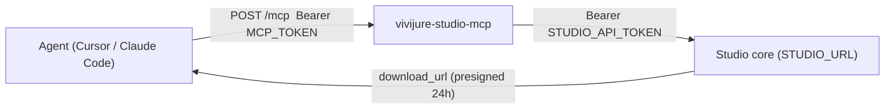

# Vivijure Studio MCP

Drive the Vivijure Studio API from an AI agent through a Model Context Protocol (MCP) server, instead
of raw `curl` or a browser. The MCP is a small, stateless Cloudflare Worker (`src/mcp.ts`) that ships
in this repo and deploys **separately** from the studio core (its own script and host,
`wrangler.mcp.toml`). It is a thin proxy: an MCP client authenticates to it with a dedicated
`MCP_TOKEN`, and it forwards each tool call to the studio using the operator's `STUDIO_API_TOKEN`.

It is **opt-in and off by default.** A default self-host does not deploy it.

## Why a separate Worker

- **Two credentials, two surfaces.** The MCP client presents `MCP_TOKEN`; the studio bearer
  (`STUDIO_API_TOKEN`, vivijure #423) never leaves the Worker. Rotate either independently.
- **No studio bindings.** The MCP holds no D1/R2/module bindings. It reaches the studio purely over
  HTTP at `STUDIO_URL`, so it can point at any instance (your self-hosted studio or a remote one).
- **Stateless.** Long-running renders are agent-driven: `submit_film` returns a job id, then the
  agent polls `poll_film` until `phase` is `done` (a presigned `download_url` appears) or `failed`.
  The Worker holds no job state and never long-polls.



## Transport

Streamable-HTTP MCP, one endpoint:

- `POST /mcp` -- JSON-RPC 2.0: `initialize`, `ping`, `tools/list`, `tools/call`. Every request must
  carry `Authorization: Bearer <MCP_TOKEN>`. Missing or wrong token, or `MCP_TOKEN` unset, returns
  `401` (fail closed). Notifications (no `id`) return `202` with no body.
- `GET /health` -- `{ ok: true, service: "vivijure-studio-mcp" }` (open, no auth).

A tool call is translated to exactly one studio HTTP request and the JSON reply is returned as MCP
text content. A **bad argument** comes back as an `isError` tool result (so the agent can correct
itself), not a transport error. `STUDIO_API_TOKEN` unset also returns an `isError` result rather than
calling the studio unauthenticated.

## Tools

Each curated tool maps to one route in [CONTRACT.md](CONTRACT.md); `studio_request` covers the rest.
POST/PATCH tools forward their whole argument object as the request body, so a new optional contract
field is usable without a code change.

| Tool | Route | Purpose |
|------|-------|---------|
| `studio_modules` | GET `/api/modules` | Registry: modules, hooks, quality tiers, motion backends. Read first. |
| `voices` | GET `/api/voices` | The 12 valid `voice_id` values. |
| `storyboard_models` | GET `/api/storyboard/models` | Valid planning model ids. |
| `list_cast` / `get_cast` | GET `/api/cast[/:id]` | Cast members. |
| `list_projects` / `get_project` | GET `/api/storyboard/projects[/:id]` | Storyboard projects. |
| `list_renders` | GET `/api/storyboard/renders` | Render history (optional `project_id`, `limit`). |
| `create_cast` | POST `/api/cast` | Create a cast member. |
| `update_cast` | PATCH `/api/cast/:id` | Update name / bible / voice. |
| `set_cast_portrait` | POST `/api/cast/:id/portrait` | Set portrait from a `chat` image artifact (`from_chat_artifact`). |
| `plan_storyboard` | POST `/api/storyboard/plan` | LLM-plan a storyboard from a brief. |
| `refine_storyboard` | POST `/api/storyboard/refine` | Refine a storyboard with an instruction. |
| `preflight` | POST `/api/storyboard/preflight` | Pre-render validation (problems are data). |
| `chat` | POST `/api/chat` | Text or image generation (image returns `output_artifact.key`). |
| `bundle_storyboard` | POST `/api/storyboard/bundle` | Assemble a render bundle -> `bundleKey`. |
| `submit_film` | POST `/api/render/film` | START a film render (SPENDS). Returns `film_id`. |
| `poll_film` | GET `/api/render/film/:id` | Advance + poll a film job. |
| `studio_request` | any | Escape hatch: `{ method, path, query?, body? }` to any route. |

No binary uploads over MCP: generate an image with `chat`, then pass its `output_artifact.key` to
`set_cast_portrait`. Binary studio responses (artifact bytes, a `.vvcast` export) are summarized, not
inlined; for a finished film use `poll_film`'s `download_url`.

### A render, end to end

1. `studio_modules` -- discover a `motion.backend` name and the quality tiers.
2. (optional) `plan_storyboard` / `refine_storyboard` -- build the storyboard.
3. `preflight` -- confirm `ok: true`.
4. `bundle_storyboard` -- get a `bundleKey`.
5. `submit_film` with `bundle_key`, `scenes`, an explicit `motion_backend`, and
   `keyframe_config: { quality_tier }` -- get a `film_id`.
6. `poll_film` on the `film_id` until `phase` is `done` (then `download_url`) or `failed`.

## Provision

The Worker needs three values: `STUDIO_URL` (var), `STUDIO_API_TOKEN` (secret, the studio bearer),
and `MCP_TOKEN` (secret, the gate). The two secrets are seeded once out-of-band, never in CI.

```sh
# 1. Render wrangler.mcp.toml from the example (host + studio URL), or copy it and fill the two
#    ${...} placeholders by hand.
MCP_HOST="studio-mcp.example.com" MCP_STUDIO_URL="https://studio.example.com" \
  envsubst '$MCP_HOST $MCP_STUDIO_URL' < wrangler.mcp.toml.example > wrangler.mcp.toml

# 2. Deploy the Worker.
npm run deploy:mcp

# 3. Seed the studio bearer (the same STUDIO_API_TOKEN the studio checks in token mode).
wrangler secret put STUDIO_API_TOKEN -c wrangler.mcp.toml

# 4. Mint + set the MCP gate token (keep a chmod 600 copy to wire clients with).
umask 077 && openssl rand -hex 32 > mcp-token.txt
wrangler secret put MCP_TOKEN -c wrangler.mcp.toml < mcp-token.txt
```

In CI (this repo's tag-gated deploy), the MCP deploys only when both `MCP_HOST` and `MCP_STUDIO_URL`
repo **variables** are set; otherwise the step is a clean no-op. The two secrets are never set in CI.

## Client wiring

Both clients use the same `MCP_TOKEN` as a bearer against `https://<MCP_HOST>/mcp`.

Cursor (`~/.cursor/mcp.json`), via the `mcp-remote` bridge:

```json
"vivijure-studio": {
  "command": "npx",
  "args": ["-y", "mcp-remote@latest", "https://studio-mcp.example.com/mcp",
           "--header", "Authorization:${AUTH_HEADER}"],
  "env": { "AUTH_HEADER": "Bearer <MCP_TOKEN>" }
}
```

Claude Code (native http transport, user scope):

```sh
claude mcp add-json vivijure-studio \
  '{"type":"http","url":"https://studio-mcp.example.com/mcp","headers":{"Authorization":"Bearer <MCP_TOKEN>"}}' \
  -s user
```

## Security boundary

- The MCP is machine-to-machine only, gated by `MCP_TOKEN` (fail closed). It is a full write path to
  the studio, including **spend** routes (`submit_film`), so treat `MCP_TOKEN` like the studio bearer.
- Keep it on a custom domain (`workers.dev` is disabled in the example) so the gate is not the only
  thing standing between the internet and the studio bearer.
- `studio_request` can reach any route; it is bounded (JSON in/out, binary summarized) but is still a
  raw pass-through. The gate is the control, not per-tool allowlisting.

## Files

- `src/mcp.ts` -- the Worker (transport, bearer gate, JSON-RPC dispatch).
- `src/mcp-tools.ts` -- the tool catalog + studio-call dispatch + `studio_request`.
- `src/mcp-env.ts` -- the `McpEnv` binding surface.
- `wrangler.mcp.toml.example` -- the committed config template (real `wrangler.mcp.toml` gitignored).
- `tests/mcp.test.ts` -- transport + dispatch tests.
