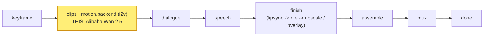

# alibaba-wan25

A **`motion.backend`** module (vivijure-module/1): the **Alibaba Wan 2.5**
image-to-video backend, run on RunPod (`wan-2-5`). It turns one shot's start keyframe into a clip at
**720p**. Same input schema as its sibling Wan 2.6 (alibaba-wan); the difference is the model and a
**continuous 3--10 second** shot length (Wan 2.6 takes a discrete duration enum). No audio param --
the core's score/mux chain owns audio.

## Where it fits

`motion.backend` is a **pick_one** hook: the studio binds exactly one motion backend per render, and
this is one selectable provider among several (seedance, kling, minimax-hailuo, google-veo, vidu-q3,
alibaba-wan, openai-sora, alibaba-wan25). It sits at the **clips** stage, right after the keyframe is
fixed and before dialogue: the keyframe drives the motion, the clip flows on into the dialogue and
speech phases and then finish.

## Contract

- **Hook**: `motion.backend` (cardinality `pick_one`). `provides: i2v-cloud` ("Alibaba Wan 2.5
  (cloud i2v)"), `ui { section: "motion", order: 90 }`.
- **Input** (`MotionBackendInput`): `shot_id`, `keyframe_url` (a presigned, fetchable URL of the
  start keyframe), `prompt`, `seconds`.
- **Config** (`config_schema`): `enable_prompt_expansion` (default off). Output size is **720p**;
  per-shot `seconds` is clamped to **3--10s**.
- **Output** (`MotionBackendOutput`): `shot_id`, `clip_key` (the stored clip), `fps` (24), `frames`.
- **Async**: cloud i2v takes minutes, longer than a Worker request can hold. `POST /invoke` submits
  to RunPod and returns a poll token immediately; `POST /poll` checks status and, on completion,
  downloads the clip and stores it to the shared **`vivijure`** R2 bucket (where the film assembler
  finds it). Bound into the core as `MODULE_ALIBABA_WAN25`.
