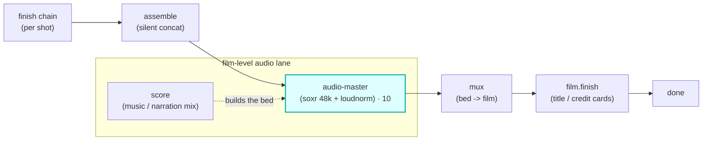

# audio-master

A **`master`**-chain module (vivijure-module/1). It masters a film's audio at **film level** -- a
**music upscale** (VHQ soxr resample to 48 kHz + a gentle high-shelf "air" lift) followed by **two-pass
LUFS loudness normalization** to a web target -- dispatched to the dedicated **vivijure-audio-master**
RunPod endpoint (CPU ffmpeg, no GPU).

It is the audio sibling of **`finish`** (which polishes a clip) and the **dialogue / speech** lane
(which polishes per-shot voice). Where `finish` and `speech` work per shot, `master` runs **once, on the
whole film's assembled audio bed**, after the mix is built (score + narration) and before that bed is
muxed onto the silent film. A **music-video** maker reaches for `master` as cleanly as a **dialogue**
maker reaches for the voice lane.

## Where it fits

The bed is the mixed `score` / narration track. `master` polishes that bed in place (it rewrites the
film's `audio_key` to the mastered key), and the mux then lays the **mastered** bed onto the silent
film. Duration is invariant -- mastering changes level and sample rate, never length.

## Configuration

Config options (the planner-projected `config_schema`; the core clamps each against it):

| Option | Type | Default | What it does |
| --- | --- | --- | --- |
| `target_lufs` | float (-24..-9) | `-14` | integrated loudness target (LUFS); `-14` is the streaming-web target |
| `upscale` | bool | `true` | music upscale: VHQ soxr resample to 48 kHz + a gentle high-shelf air lift |
| `format` | enum `wav` / `mp3` | `wav` | output bed format (mastering may re-encode) |

To self-host (service `vivijure-module-audio-master`, bound into the core as `MODULE_AUDIO_MASTER`):

- **Env at deploy**: `CLOUDFLARE_ACCOUNT_ID` (account_id is injected, never hardcoded).
- **Secrets** (`wrangler secret put`, after deploy): `RUNPOD_API_KEY` and `RUNPOD_ENDPOINT_ID` (YOUR
  vivijure-audio-master endpoint id; kept a secret, #38).
- **Provision**: a DEDICATED RunPod serverless endpoint running the `vivijure-audio-master` image
  (slim CPU ffmpeg, `containers/audio-master/`), SEPARATE from the GPU backends. No R2 binding -- the
  endpoint reads `audio_key` and writes the output in the shared bucket itself.

## Contract

- **Hook**: `master` (cardinality `chain`). `ui { section: "master", icon: "sliders", order: 10 }`.
- **Input** (`MasterInput`): `film_id`, `audio_key` (the assembled bed), optional `seconds` (a length
  hint; the backend probes the bed if absent).
- **Output** (`MasterOutput`): `audio_key` (the mastered bed, beside the source with a `_mastered`
  suffix), `applied`, and `degraded` set ONLY on a real passthrough.
- **Async**: `POST /invoke` submits to RunPod and returns a poll token; `POST /poll` checks
  `/status/{jobId}` (with the GC-grace window, #141) and returns the output on completion.
- **R2 transport**: the endpoint reads `audio_key` and writes the output in the shared bucket itself;
  this worker holds no R2 creds.

## Soft-degrade

*A polish step: never fail the render, never fake the tag (#249 / #77).*

A missing endpoint or any backend failure (run rejected, no job id, GC'd job, FAILED job, missing
output) passes the **input** `audio_key` through unchanged with `applied: ["passthrough:<reason>"]` and
`degraded` set to the honest reason, so the mux always has a bed to lay down. The only hard `ok:false`
is malformed input (no `film_id` / `audio_key`) or a bad poll token. A master miss therefore degrades to
the un-mastered (but intact) audio; it never drops a fully-rendered film.

## License

**AGPL-3.0-only.** A labor of love, given freely: use it, learn from it, self-host it, build your own creative visions on it. Run it as a network service and the AGPL has you share your changes back, so it stays a commons. It is not for sale, and not to be resold as a SaaS.
