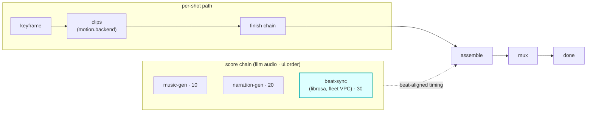

# beat-sync

A `score`-hook module (vivijure-module/1). It runs [librosa](https://librosa.org/) beat analysis on
an always-on container over Workers VPC (Hetzner fleet) and returns **shot timing aligned to the
music bed**, so cuts land on the beat.

## Where it fits

`score` is a film-level audio chain (cardinality `chain`, `0..n`, ordered by `ui.order`), **parallel
to the per-shot path**. beat-sync is the last score step (`ui.order` 30): it reads the music bed
produced upstream (music-gen at 10) and computes beat-aligned timing for the cut. When invoked
without an audio bed (no music in the chain), it passes the `film_key` through unchanged.

The seam is the timing it returns: beat-sync analyzes the bed and reports where the beats fall, which
the assemble step uses to time the cut. It generates no audio of its own; it shapes how the film is
assembled to the audio already there.

## Contract

- **Hook**: `score` (cardinality `chain`). **Provides**: `librosa-beat-sync`,
  "Beat sync (librosa, fleet VPC)". `ui { section: "score", order: 30 }`.
- **Config** (`config_schema`): `target_seconds` (target seconds per shot), `mode` (timing mode),
  `min_seconds` / `max_seconds` (beat mode bounds), `force_shots` (duration mode; 0 = auto). The
  `audio_url` + `audio_key` are runtime fields passed in config at invoke time, not in the schema.
- **Sync**: analysis completes in one `POST /invoke` (no `/poll`). The core presigns the audio bed
  and passes `audio_url` + `audio_key` at invoke time.

## Deploy

Service `vivijure-module-beat-sync`, bound into the core as `MODULE_BEAT_SYNC`. Binding:
`AUDIO_BEAT_SYNC_VPC` (the audio-beat-sync container over Workers VPC; issue #83). See `wrangler.toml`.
