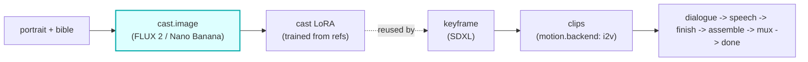

# cast-image

A first-class **`cast.image`**-hook module (vivijure-module/1). It generates a character's LoRA
**training reference set** from a portrait + bible, via the studio's image models (FLUX 2 Klein / Nano
Banana Pro) with a safety-flag fallback.

This is a **pre-render side hook**: it runs at casting time, before any shot is rendered, so the cast
member has a trained look the keyframe stage can lock onto.

## Where it fits

The seam is the reference set: this module writes the generated training images to the shared bucket,
the cast member's LoRA is trained from them, and the **keyframe** stage reuses that adapter so every
shot renders the character on-model. It is pre-render, off the per-shot path entirely.

## Contract

- **Hook**: `cast.image` (one producer; pre-render). `ui { section: "cast", order: 10 }`.
- **Input** (`CastImageInput`): `cast_id`, `portrait_url` (presigned), optional `portrait_key`,
  `source_urls`, `bible`, `art_style`.
- **Config** (`config_schema`): `model` (FLUX 2 Klein 9b/4b, Nano Banana Pro, FLUX 2 dev) and
  `num_images` (4..TRAINING_PROMPTS.length, default 10).
- **Output** (`CastImageOutput`): `cast_id`, `images[]` (`key`, `mime`), `applied`.
- **Async**: `POST /invoke` composes the prompt set and persists run state to R2, returning a stable
  poll pointer; `POST /poll` renders the next prompt(s) (a few per cycle) and returns pending until the
  queue drains. A safety-flagged model auto-falls back to the configured fallback model mid-run.
- **R2 transport**: run state and generated refs land in the shared `vivijure` bucket.

This is a producer stage: a real generation failure (post-fallback) is an honest `ok:false`, not a
fake-success tag.

## Deploy

Service `vivijure-module-cast-image`, bound into the core as `MODULE_CAST_IMAGE`. Bindings: Workers AI
(`AI`), the shared R2 bucket (`R2_RENDERS`), optional Cloudflare Images (`IMAGES`, downscales refs to
<=512px). Secret (set after deploy): `GATEWAY_ID` (AI Gateway slug). See `wrangler.toml`.
