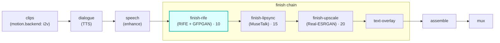

# finish-rife

A **`finish`**-chain module (vivijure-module/1). It smooths a shot's motion with **RIFE** frame
interpolation and optionally relocks faces with **GFPGAN/CodeFormer**, dispatched as `finish_clip` to
the shared **vivijure-backend** RunPod endpoint.

It is the **first link in the finish chain** (`order: 10`), so a clip is smoothed before lip-sync
rewrites the mouth and before the upscaler enlarges it.

## Where it fits

The finish chain runs in ascending `ui.order`: **rife (10) -> lipsync (15) -> upscale (20)**. Smoothing
first means lip-sync and upscale both operate on the higher-frame-rate, face-restored clip.

## Contract

- **Hook**: `finish` (cardinality `chain`). `ui { section: "finish", icon: "wand", order: 10 }`.
- **Input** (`FinishInput`): `shot_id`, `clip_key`, `src_fps`, `frames`, `width`, `height` (the
  optional `audio_key` is for lipsync; rife ignores it).
- **Config** (`config_schema`): `interpolate` (bool), `interpolation_factor` (1/2/4/8x), `face_restore`
  (none/gfpgan/codeformer), `face_fidelity`, `only_faces`.
- **Output** (`FinishOutput`): `shot_id`, `clip_key` (the finished clip), `out_fps`, `frames`,
  `applied`, and `degraded` set ONLY on a real passthrough.
- **Async**: `POST /invoke` submits to RunPod and returns a poll token; `POST /poll` checks
  `/status/{jobId}` (with the GC-grace window, #141) and returns the output on completion.
- **R2 transport**: the backend reads `clip_key` and writes the finished clip in the shared bucket
  itself; this worker holds no R2 creds.

## Soft-degrade (a polish step -- never fail the chain, never fake the tag; #249/#77)

Nothing enabled is a legitimate NO-OP (`applied` tagged, `degraded` unset). A missing endpoint or any
backend failure passes the **input** `clip_key` through unchanged with `degraded` set to the honest
reason, so the chain always has a clip to hand on. The only hard `ok:false` is malformed input (no
`shot_id`/`clip_key`) or a bad poll token.

## Deploy

Service `vivijure-module-finish-rife`, bound into the core as `MODULE_FINISH_RIFE`. Secrets (set after
deploy): `RUNPOD_API_KEY`, `RUNPOD_ENDPOINT_ID` (the vivijure-backend endpoint id). See `wrangler.toml`.
