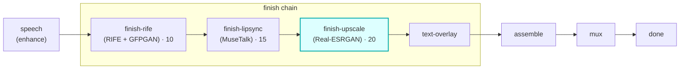

# finish-upscale

A **`finish`**-chain module (vivijure-module/1). It upscales a shot's resolution (2x/4x) with
**Real-ESRGAN**, dispatched to the dedicated **vivijure-upscale** RunPod endpoint (CUDA, separate from
vivijure-backend).

It is the **last link in the finish chain** (`order: 20`), so it enlarges a clip that has already been
smoothed (rife) and lip-synced (MuseTalk); upscaling last means the polish steps above operate at the
cheaper native resolution.

## Where it fits

The finish chain runs in ascending `ui.order`: **rife (10) -> lipsync (15) -> upscale (20)**. Upscaling
is the final spatial polish; the enlarged clip then flows to text-overlay (if enabled) and on to
assemble.

## Contract

- **Hook**: `finish` (cardinality `chain`). `ui { section: "finish", icon: "expand", order: 20 }`.
- **Input** (`FinishInput`): `shot_id`, `clip_key`, `src_fps`, `frames`, `width`, `height` (the
  optional `audio_key` is for lipsync; the upscaler ignores it).
- **Config** (`config_schema`): `scale` (2x/4x), `model` (realesr-animevideov3 / RealESRGAN_x4plus).
- **Output** (`FinishOutput`): `shot_id`, `clip_key` (the upscaled clip), `out_fps`, `frames`,
  `applied`, and `degraded` set ONLY on a real passthrough.
- **Async**: `POST /invoke` submits to RunPod and returns a poll token; `POST /poll` checks
  `/status/{jobId}` (with the GC-grace window, #141) and returns the output on completion.
- **R2 transport**: the endpoint reads `clip_key` and writes the output in the shared bucket itself;
  this worker holds no R2 creds.

## Soft-degrade (a polish step -- never fail the chain, never fake the tag; #249/#77)

A missing endpoint or any backend failure passes the **input** `clip_key` through unchanged with
`degraded` set to the honest reason, so the chain always has a clip to hand on. The only hard
`ok:false` is malformed input (no `shot_id`/`clip_key`) or a bad poll token.

## Deploy

Service `vivijure-module-finish-upscale`, bound into the core as `MODULE_FINISH_UPSCALE`. Secrets (set
after deploy): `RUNPOD_API_KEY`, `RUNPOD_ENDPOINT_ID` (the vivijure-upscale endpoint id). See
`wrangler.toml`.
