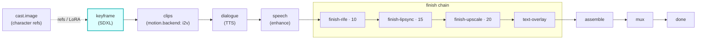

# keyframe

A first-class **`keyframe`**-hook module (vivijure-module/1). It turns a project's storyboard into one
**start keyframe per shot** with SDXL, dispatched to the **vivijure-backend** RunPod endpoint in its
keyframes-only mode (`action=preview`).

This is the **first render stage**: every later stage animates, finishes, and assembles off these
frames. It is a PROJECT-level pass (one job emits every shot's keyframe and trains/reuses the cast
LoRAs once), never a per-shot job, so a render never re-trains an adapter it already has.

## Where it fits

The seam is the keyframe key: the backend writes each shot's PNG to the shared `vivijure` bucket, this
module reports the keys, and the core presigns them so the **motion.backend** stage can pull each frame
and animate it. Freshly trained cast LoRAs are reported back so they are reused across projects.

## Contract

- **Hook**: `keyframe` (one producer; first render stage). `ui { section: "keyframe", order: 10 }`.
- **Input** (`KeyframeInput`): `project`, `bundle_key` (the storyboard bundle), optional `shot_ids`
  and `pretrained_loras` (slot -> R2 key of an already-trained adapter to reuse).
- **Config** (`config_schema`): `quality_tier` (draft/standard/final), `width`/`height` (default
  1344x768, 16:9 so the whole chain stays 16:9), `steps`, `guidance_scale`, `seed`.
- **Output** (`KeyframeOutput`): `project`, `keyframes[]` (`shot_id` + `keyframe_key`), and optional
  `trained_loras` (slot -> R2 key) the core records back onto the cast so future renders reuse them.
- **Async**: `POST /invoke` submits to RunPod and returns a poll token; `POST /poll` checks
  `/status/{jobId}` (with the GC-grace window, #141) and returns the keys on completion.
- **R2 transport**: the backend reads/writes the shared bucket itself; this worker holds no R2 creds.

This is a producer stage, not a polish step: a real failure is an honest `ok:false` (no soft-degrade,
no fake keyframes), because nothing downstream can animate a frame that was never rendered.

## Deploy

Service `vivijure-module-keyframe`, bound into the core as `MODULE_KEYFRAME`. Secrets (set after
deploy): `RUNPOD_API_KEY`, `RUNPOD_ENDPOINT_ID` (the vivijure-backend endpoint id, kept secret so the
public repo never exposes it). See `wrangler.toml`.
