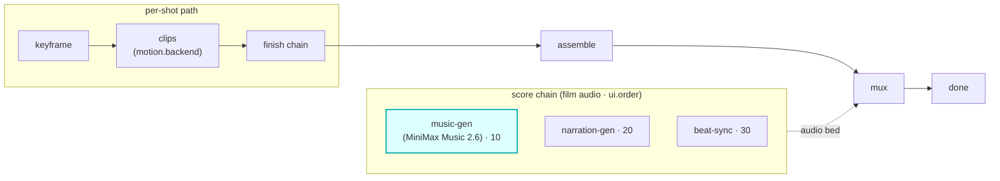

# music-gen

A `score`-hook module (vivijure-module/1). It generates a **music bed for the whole film** with
[MiniMax Music 2.6](https://www.minimax.io/) through Workers AI and the AI Gateway (Unified Billing,
keyless), then writes the track to R2 for muxing onto the assembled film.

## Where it fits

`score` is a film-level audio chain (cardinality `chain`, `0..n`, ordered by `ui.order`). It runs
**parallel to the per-shot path**: while keyframe / clips / finish work shot by shot, the score chain
produces the film's audio bed, which video-finish muxes onto the assembled cut. music-gen is the
first score step (`ui.order` 10), ahead of narration-gen (20) and beat-sync (30).

The seam is the muxed bed: the score chain produces audio keyed in R2; muxing it onto the film is
video-finish's job, not this module's. So music-gen never touches a clip; it only adds a track.

## Contract

- **Hook**: `score` (cardinality `chain`). **Provides**: `minimax-music`,
  "MiniMax Music 2.6 (Workers AI)". `ui { section: "score", order: 10 }`.
- **Config** (`config_schema`): `prompt` (blank derives from the storyboard), `lyrics`,
  `is_instrumental` (default true), `lyrics_optimizer`, `format` (default mp3), `bitrate`,
  `sample_rate`.
- **Async**: a MiniMax generation is a single blocking `env.AI.run` with no async handle, so the
  module runs it inside a Durable `SCORE_WORKFLOW` (`MusicGenWorkflow`). `POST /invoke` starts the
  workflow and returns a poll token; `POST /poll` returns the result when the track is written.
- **R2 transport**: the finished track is written to the shared `vivijure` bucket (`R2_RENDERS`).

## Deploy

Service `vivijure-module-music-gen`, bound into the core as `MODULE_MUSIC_GEN`. Bindings: `AI`
(Workers AI + AI Gateway), `R2_RENDERS`, `SCORE_WORKFLOW`. See `wrangler.toml`.
