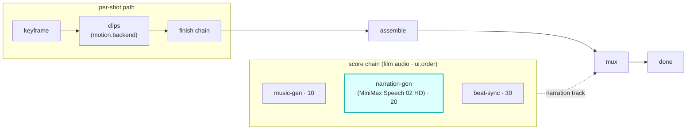

# narration-gen

A `score`-hook module (vivijure-module/1). It synthesizes **narration / voice-over for the whole
film** with [MiniMax Speech 02 HD](https://www.minimax.io/) on a RunPod endpoint, then writes the
track to R2 for muxing onto the assembled film.

## Where it fits

`score` is a film-level audio chain (cardinality `chain`, `0..n`, ordered by `ui.order`), **parallel
to the per-shot path**. Note the distinction: this is narration laid **over the film** on the score
lane, not the per-shot `dialogue` hook (lip-synced speech per cast member). narration-gen sits at
`ui.order` 20, after music-gen (10) and before beat-sync (30).

The seam is the muxed track: narration-gen produces audio keyed in R2; muxing it onto the film is
video-finish's job. The per-shot `dialogue` hook is a separate lane and is unaffected.

## Contract

- **Hook**: `score` (cardinality `chain`). **Provides**: `minimax-speech`,
  "MiniMax Speech 02 HD (RunPod)". `ui { section: "score", order: 20 }`.
- **Config** (`config_schema`): `script` (blank derives from the storyboard), `voice_id`, `emotion`,
  `format` (default mp3), `pitch`, `speed`, `volume`, `sample_rate`.
- **Async**: `POST /invoke` submits the RunPod job and returns a poll token immediately (no blocking
  on the wire); `POST /poll` returns the track when the job completes. Failures are **data**
  (`ok:false`), never thrown across the wire.
- **R2 transport**: the finished track is written to the shared `vivijure` bucket (`R2_RENDERS`).

## Deploy

Service `vivijure-module-narration-gen`, bound into the core as `MODULE_NARRATION_GEN`. Bindings:
`R2_RENDERS`. Secrets: the RunPod endpoint credentials. See `wrangler.toml`.
