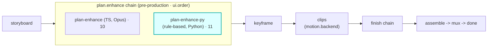

# plan-enhance-py (Python on-ramp proof)

> EXPERIMENTAL. Cloudflare Python Workers is **open beta**, not GA. This is an additive **proof
> module**: it demonstrates the second authoring on-ramp. Nothing in the render core or the critical
> control plane depends on it.

A Vivijure `plan.enhance` module worker (`vivijure-module/1`) written in **Python** instead of
TypeScript. It proves the module contract is **language-agnostic**: modules speak a typed JSON
contract over service bindings, so the core never knows (or cares) what language answers a hook. A
module can be Python OR TS.

## What it does

A deterministic, rule-based director pass over a storyboard's shot prompts: it appends cinematic
direction cues (lighting / framing / camera) per the chosen `intensity`. It is the deterministic
sibling of the TS [`plan-enhance`](../plan-enhance) module (which uses an LLM). Same hook, same
contract; different language and a different (offline, reproducible) implementation.

Because `plan.enhance` is a **chain** hook, this module and the TS `plan-enhance` can both be
installed at once and both run in `ui.order` (TS at order 10, this at order 11). The distinct name
(`plan-enhance-py`) keeps them collision-free.

## Why Python here (and the scope line)

CF Python Workers run on Pyodide (Python on WASM). They are great for **light control-plane logic**
(`plan.enhance`, `score`, orchestration glue) and have **no torch/CUDA**, so they **cannot** run the
GPU render. The heavy path stays on RunPod. This module is pure stdlib (no deps), no GPU, no network,
no bindings.

## Where it fits

`plan.enhance` is a **pre-production** chain (cardinality `chain`, `0..n`, ordered by `ui.order`): it
runs on the storyboard **before keyframe**. Because the hook is a chain, this Python module and the
TS [`plan-enhance`](../plan-enhance) both run, in `ui.order` (TS at 10, this at 11), each enriching
the storyboard in turn before any frame is rendered.



The seam is the storyboard itself: this module returns an enriched storyboard, structurally
unchanged (same scenes), that keyframe and the rest of the pipeline render from.

## Configuration

`config_schema` (the core clamps against it; the planner projects each field into a control):

| Option | Type | Default | What it does |
|---|---|---|---|
| `intensity` | enum (`light`, `medium`, `bold`) | `medium` | how strongly the rule-based pass appends direction cues to each shot prompt |

**Self-host**: no bindings, no secrets, no deps (pure stdlib; runs on the Pyodide runtime via
`compatibility_flags = ["python_workers"]`, `main = src/entry.py`). It is bound into the core as the
`MODULE_PLANENHANCE_PY` service binding when installed (see the Wiring section below).

## Endpoints (the contract)

| Endpoint | Purpose |
|---|---|
| `GET /module.json` | the manifest (the core's registry discovers + indexes it) |
| `POST /invoke` | run the `plan.enhance` hook: `{ hook, input, config, context }` in, an `InvokeResponse` out |

A failure is **data**, never an exception: a bad request returns HTTP 200 `{ ok: false, error }`.

## Files

| File | What |
|---|---|
| `src/entry.py` | the Worker entrypoint (`Default(WorkerEntrypoint)`): manifest + `/invoke` routing |
| `src/enhance.py` | the pure enrichment logic (dependency-free, runs under plain CPython for tests) |
| `wrangler.toml` | `main = src/entry.py`, `compatibility_flags = ["python_workers"]` |
| `pyproject.toml` | pywrangler project marker (no deps) |

## Develop / run

Uses [pywrangler](https://github.com/cloudflare/workers-py) (the Python Workers CLI; needs `uv`):

```sh
uvx --from workers-py pywrangler dev    # local Pyodide runtime
uvx --from workers-py pywrangler deploy # deploy
```

Local invoke round-trip (what was used to validate it):

```sh
curl localhost:8788/module.json
curl -X POST localhost:8788/invoke -H 'content-type: application/json' \
  -d '{"hook":"plan.enhance","input":{"storyboard":{"scenes":[{"prompt":"a quiet street at night"}]}},"config":{"intensity":"bold"},"context":{"project":"x","job_id":"1"}}'
```

## Conformance

The pure logic is unit-checked under CPython; the manifest + `InvokeResponse` shapes are validated
against the core conformance harness in `tests/plan-enhance-py-conformance.test.ts`. For a deployed
instance, point the live runner at it: `MODULE_URL=<url> npx vitest run tests/conformance.live.test.ts`.

## Wiring

Bound into the core as the `MODULE_PLANENHANCE_PY` service binding (see the core `wrangler.toml`).
The registry discovers it from `GET /module.json` like any other module.
