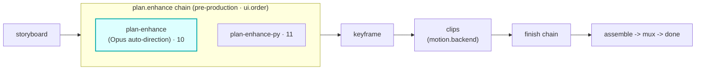

# plan-enhance

A `plan.enhance`-hook module (vivijure-module/1). A **pre-production director pass**: it enriches a
storyboard's shot prompts with cinematic direction (camera, lighting, framing) using the latest Opus
through Cloudflare AI Gateway (Unified Billing, keyless), before any frame is rendered.

## Where it fits

`plan.enhance` is a **pre-production** chain (cardinality `chain`, `0..n`, ordered by `ui.order`): it
runs on the storyboard **before keyframe**, so every downstream stage renders from the enriched plan.
plan-enhance is the first step (`ui.order` 10); the deterministic Python sibling
[`plan-enhance-py`](../plan-enhance-py) sits just after it (11).

The seam is the storyboard itself: this module returns an enriched storyboard, structurally
unchanged (same scenes), that keyframe and the rest of the pipeline render from.

## Contract

- **Hook**: `plan.enhance` (cardinality `chain`). **Provides**: `auto-direction`,
  "Opus auto-direction". `ui { section: "plan", order: 10 }`.
- **Config** (`config_schema`): `intensity` (direction intensity).
- **Two providers, one contract**: Opus first (via AI Gateway) when both `GATEWAY_ID` and
  `CF_AIG_TOKEN` are configured; otherwise (or on any Opus error) it degrades to the free Workers AI
  local model (`@cf/meta/llama-3.3-70b-instruct-fp8-fast`). Swapping an expensive cloud model for a
  free local one without touching the hook is the Vivijure modularity thesis in one module.
- **Sync**: `POST /invoke` returns the enriched storyboard in one call.

## Soft-degrade

A failure is **data**, never an exception. No model available, or an unparseable reply, returns the
storyboard passed through unchanged with an honest note rather than failing pre-production.

## Deploy

Service `vivijure-module-plan-enhance`, bound into the core as `MODULE_PLANENHANCE`. Binding: `AI`
(Workers AI runner + AI Gateway accessor). Secrets (optional, both required for Opus): `GATEWAY_ID`,
`CF_AIG_TOKEN`. See `wrangler.toml`.
