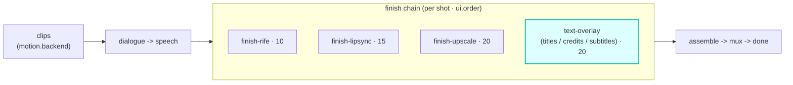

# text-overlay

A `finish`-hook module (vivijure-module/1). It burns **titles, credits, lower-thirds, and subtitles**
onto a rendered clip via the video-finish CPU container over Workers VPC (issue #190).

## Where it fits

`finish` is the per-shot post-processing chain (cardinality `chain`, `0..n`, ordered by `ui.order`).
text-overlay sits **late** at `ui.order` 20, after frame interpolation (finish-rife, 10), lip-sync
(finish-lipsync, 15), and alongside upscale (finish-upscale, 20). Running last is the point: text is
burned onto the final-resolution frames, so it is never interpolated or upscaled after the fact.

The seam is the clip: a finish module takes one rendered clip and returns the processed clip plus
what it did. Every clip in one render is processed with the same config, so all outputs stay uniform.

## Configuration

`config_schema` (per-shot defaults; the core clamps against it, the planner projects each field):

| Option | Type | Default | What it does |
|---|---|---|---|
| `font` | string | `DejaVu Sans` | default font (must be installed in the video-finish container) |
| `size` | int | `48` | default font size in px (8 to 400) |
| `color` | string | `white` | default font color (name or `#rrggbb`) |
| `safe_margin` | int | `50` | safe margin in px from the frame edge (0 to 500) |

The per-shot overlay list (text, position, timing) is a runtime input, not part of the schema.

**Self-host**: service `vivijure-module-text-overlay`, bound into the core as `MODULE_TEXT_OVERLAY`.
Bindings: `R2_RENDERS` (R2 bucket `vivijure`), `VIDEO_FINISH_VPC` (the video-finish CPU container
over Workers VPC). No secrets. See `wrangler.toml`.

## Contract

- **Hook**: `finish` (cardinality `chain`). **Provides**: `text-overlay`,
  "Text overlay (titles / credits / subtitles)". `ui { section: "finish", order: 20 }`.
- **R2 transport**: the container reads the clip and writes the overlaid clip back to the shared
  bucket.

## Soft-degrade

A polish step never fails the chain. No overlays defined for the shot is an intentional no-op
(`no-overlays`, not a degrade); a container failure passes the original clip through unchanged tagged
`passthrough:container-failed` with `degraded` set, so the next finish step always has a clip.

## License

**AGPL-3.0-only.** A labor of love, given freely: use it, learn from it, self-host it, build your own creative visions on it. Run it as a network service and the AGPL has you share your changes back, so it stays a commons. It is not for sale, and not to be resold as a SaaS.
