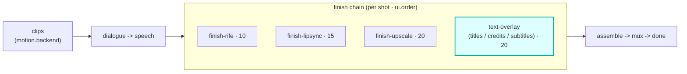

# text-overlay

A `finish`-hook module (vivijure-module/1). It burns **titles, credits, lower-thirds, and subtitles**
onto a rendered clip via the video-finish CPU container over Workers VPC (issue #190).

## Where it fits

`finish` is the per-shot post-processing chain (cardinality `chain`, `0..n`, ordered by `ui.order`).
text-overlay sits **late** at `ui.order` 20, after frame interpolation (finish-rife, 10), lip-sync
(finish-lipsync, 15), and alongside upscale (finish-upscale, 20). Running last is the point: text is
burned onto the final-resolution frames, so it is never interpolated or upscaled after the fact.

The seam is the clip: a finish module takes one rendered clip and returns the processed clip plus
what it did. Every clip in one render is processed with the same config, so all outputs stay uniform.

## Contract

- **Hook**: `finish` (cardinality `chain`). **Provides**: `text-overlay`,
  "Text overlay (titles / credits / subtitles)". `ui { section: "finish", order: 20 }`.
- **Config** (`config_schema`): `font` (default font, must be installed in the video-finish
  container), `size`, `color`, `safe_margin`. The per-shot overlay list is a runtime input.
- **R2 transport**: the container reads the clip and writes the overlaid clip back to the shared
  bucket (`R2_RENDERS`).

## Soft-degrade

A polish step never fails the chain. No overlays defined for the shot is an intentional no-op
(`no-overlays`, not a degrade); a container failure passes the original clip through unchanged tagged
`passthrough:container-failed` with `degraded` set, so the next finish step always has a clip.

## Deploy

Service `vivijure-module-text-overlay`, bound into the core as `MODULE_TEXT_OVERLAY`. Bindings:
`R2_RENDERS`, `VIDEO_FINISH_VPC` (the video-finish CPU container over Workers VPC). See `wrangler.toml`.
